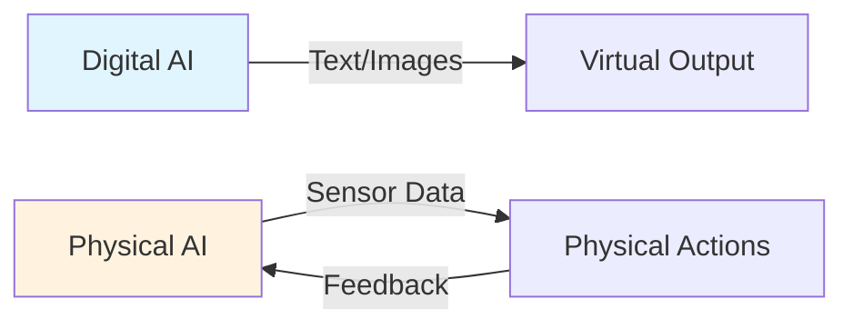
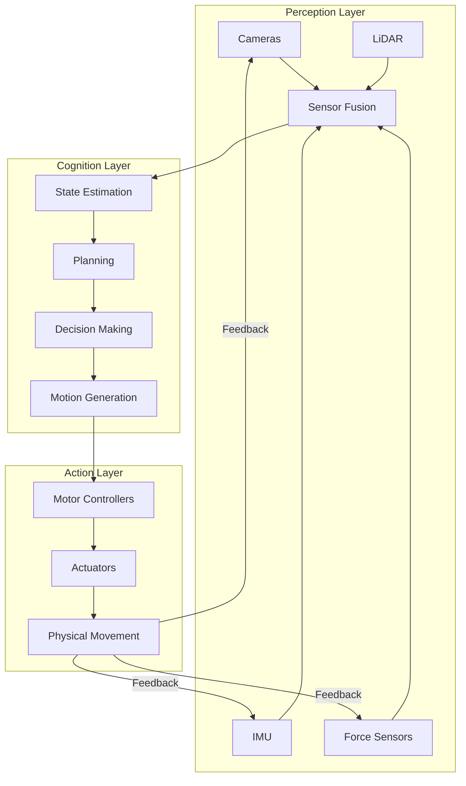
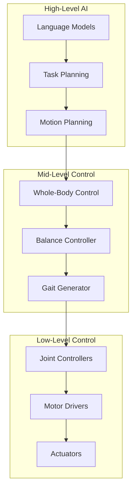

# Week 1: Introduction to Physical AI

## Learning Outcomes

By the end of this chapter, you should be able to:
- Define Physical AI and explain how it differs from traditional digital AI
- Understand the concept of embodied intelligence and its importance
- Identify the key components of humanoid robotic systems
- Explain the transition from simulation to real-world deployment
- Recognize the challenges unique to physical AI systems

## The Physics (Why)

Traditional AI operates in digital environments—processing text, images, and data in isolation from the physical world. But the real world is governed by physics: gravity pulls objects down, friction resists motion, and momentum carries moving bodies forward.

**Physical AI** bridges this gap by creating AI systems that comprehend and operate within physical laws. Unlike a chatbot that only needs to generate text, a humanoid robot must:

- **Balance** against gravity while standing and walking
- **Navigate** around obstacles in 3D space
- **Manipulate** objects with appropriate force
- **React** to unexpected physical disturbances in real-time

This is the fundamental challenge: digital AI can afford to be wrong occasionally, but physical AI mistakes can result in damaged hardware, failed tasks, or safety hazards.



## The Analogy (Mental Model)

Think of the difference between **reading about swimming** and **actually swimming**.

A digital AI is like someone who has read every book about swimming—they understand the theory of buoyancy, the physics of propulsion, and the optimal stroke techniques. But they've never touched water.

Physical AI is like actually getting in the pool. Suddenly, all that theoretical knowledge must be applied in real-time while dealing with:
- Water resistance you can feel but can't perfectly predict
- Balance that shifts with every movement
- Breathing that must be coordinated with strokes
- Fatigue that changes your capabilities over time

The transition from digital to physical AI is this same leap—from theoretical understanding to embodied action.

## The Visualization (System Architecture)

A Physical AI system consists of three interconnected layers:



### The Perception-Action Loop

Unlike digital AI which processes data in batches, Physical AI operates in a continuous **perception-action loop**:

1. **Sense**: Gather data from cameras, LiDAR, IMUs, and force sensors
2. **Process**: Fuse sensor data into a coherent world model
3. **Plan**: Determine the next action based on goals and constraints
4. **Act**: Execute motor commands to move the robot
5. **Repeat**: The cycle continues at 100-1000 Hz

:::tip Real-Time Requirements
Physical AI systems must complete this entire loop in milliseconds. A humanoid robot's balance controller typically runs at 1000 Hz (1ms per cycle). Any delay can cause the robot to fall.
:::

## The Code (Implementation)

Let's look at a simple example that illustrates the difference between digital and physical AI approaches:

```python
#!/usr/bin/env python3
"""
Comparison: Digital AI vs Physical AI approaches
Demonstrates the fundamental differences in system design.
"""

# Digital AI: Image Classification
# - Input: Static image
# - Output: Label
# - No physical consequences

def digital_ai_classify(image_path: str) -> str:
    """
    Digital AI processes data without physical consequences.
    Errors result in wrong labels, not physical damage.
    """
    # Load and process image
    # Return classification label
    return "cat"  # Simple, stateless operation


# Physical AI: Robot Object Grasping
# - Input: Continuous sensor streams
# - Output: Motor commands
# - Physical consequences for errors

class PhysicalAIGrasper:
    """
    Physical AI must handle continuous sensing, planning, and acting.
    Errors can damage the robot or environment.
    """
    
    def __init__(self):
        self.gripper_force = 0.0
        self.object_detected = False
        self.grasp_successful = False
    
    def sense(self, force_sensor: float, camera_data: dict) -> dict:
        """
        Continuously gather sensor data.
        Must handle noise, delays, and sensor failures.
        """
        return {
            "force": force_sensor,
            "object_position": camera_data.get("position"),
            "object_fragile": camera_data.get("fragile", False)
        }
    
    def plan(self, sensor_data: dict) -> dict:
        """
        Plan actions considering physical constraints.
        Must account for object properties and safety limits.
        """
        max_force = 5.0 if sensor_data["object_fragile"] else 20.0
        
        return {
            "target_force": min(sensor_data["force"] + 1.0, max_force),
            "approach_speed": 0.1,  # m/s - slow for safety
        }
    
    def act(self, plan: dict) -> None:
        """
        Execute physical actions.
        Must be reversible and safe.
        """
        self.gripper_force = plan["target_force"]
        # In real system: send commands to motor controllers
    
    def run_loop(self, force_sensor: float, camera_data: dict) -> None:
        """
        The perception-action loop runs continuously.
        This is the core of Physical AI.
        """
        sensor_data = self.sense(force_sensor, camera_data)
        action_plan = self.plan(sensor_data)
        self.act(action_plan)
```

## The Hardware Reality (Warning)

Physical AI systems face constraints that digital AI never encounters:

:::danger Safety First
Physical AI mistakes have real consequences:
- **Robot damage**: Motors can burn out, joints can break
- **Environmental damage**: Objects can be crushed or dropped
- **Safety hazards**: Humans can be injured by robot movements

Always implement emergency stops and force limits!
:::

### Key Hardware Constraints

| Constraint | Digital AI | Physical AI |
|------------|-----------|-------------|
| **Latency** | Seconds acceptable | Milliseconds required |
| **Power** | Unlimited (wall power) | Limited (batteries) |
| **Errors** | Retry freely | May cause damage |
| **Testing** | Unlimited iterations | Hardware wear |
| **Environment** | Controlled data | Unpredictable world |

### The Reality Gap

One of the biggest challenges in Physical AI is the **reality gap**—the difference between simulation and the real world:


**Common Reality Gap Issues:**
- Simulated friction doesn't match real surfaces
- Sensor noise is higher than simulated
- Lighting conditions vary unpredictably
- Objects have different weights than expected
- Actuators have delays and backlash

:::warning Sim-to-Real Transfer
Never assume a model that works in simulation will work in reality. Always:
1. Test with domain randomization in simulation
2. Start with conservative parameters in real deployment
3. Gradually increase performance as you validate behavior
:::

## The Humanoid Robotics Landscape

Humanoid robots represent the pinnacle of Physical AI—machines that share our physical form and can operate in human environments.

### Why Humanoids?

1. **Human-designed environments**: Stairs, doors, and tools are built for human bodies
2. **Abundant training data**: Human motion capture provides rich learning signals
3. **Natural interaction**: Humans intuitively understand humanoid gestures and movements
4. **Versatility**: A human form can perform diverse tasks without specialized tools

### Current State of the Art

| Robot | Company | Capabilities | Price Range |
|-------|---------|--------------|-------------|
| Atlas | Boston Dynamics | Dynamic movement, parkour | Research only |
| Optimus | Tesla | General purpose, manufacturing | ~$20,000 (target) |
| Figure 01 | Figure AI | Warehouse tasks, learning | Commercial |
| H1/G1 | Unitree | Walking, basic manipulation | $16,000-$90,000 |

### The Software Stack

Modern humanoid robots run complex software stacks:



## Assessment

### Recall

1. What is the fundamental difference between digital AI and Physical AI?
2. Name three types of sensors commonly used in humanoid robots.
3. What is the "reality gap" and why does it matter?
4. At what frequency does a typical humanoid balance controller operate?

### Apply

1. Design a simple perception-action loop for a robot that must pick up a cup without spilling its contents. What sensors would you need? What safety constraints would you implement?

2. You have a robot arm that works perfectly in simulation but drops objects 50% of the time in the real world. List three possible causes and how you would diagnose each.

3. Calculate the maximum acceptable latency for a humanoid robot walking at 1 m/s if it needs to detect and avoid obstacles at least 0.5 meters away.

### Analyze

1. Compare the challenges of deploying a language model (like GPT) versus deploying a humanoid robot. Which has higher stakes for errors? Which is easier to update after deployment?

2. Why might a company choose to develop a quadruped robot (like Spot) before a humanoid robot? What are the trade-offs?

3. Analyze the ethical implications of humanoid robots that can perform physical labor. How should society prepare for this technology?
