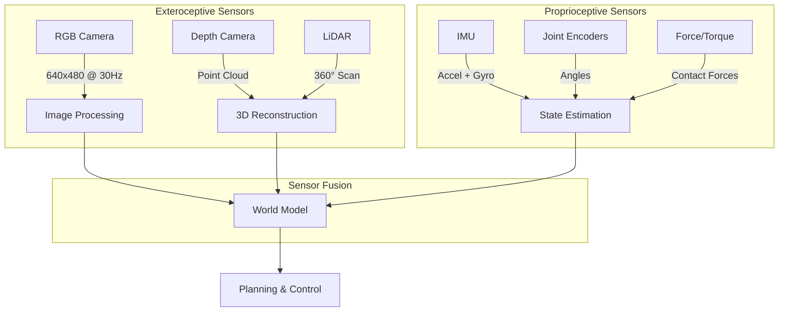
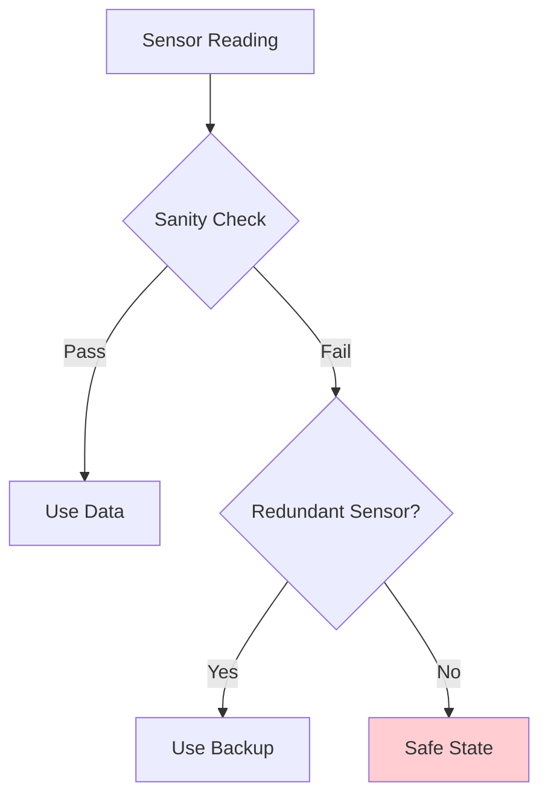

# Week 2: Sensors and Embodiment

## Learning Outcomes

By the end of this chapter, you should be able to:
- Explain the role of different sensor types in robotic perception
- Understand how LiDAR, cameras, IMUs, and force sensors work
- Design a sensor suite for a humanoid robot application
- Implement basic sensor data processing in Python
- Recognize sensor limitations and failure modes

## The Physics (Why)

For a robot to interact with the physical world, it must first **perceive** that world. Sensors are the robot's interface to reality—they convert physical phenomena (light, distance, acceleration, force) into electrical signals that can be processed by computers.

The choice of sensors fundamentally shapes what a robot can do:
- **Without vision**, a robot cannot recognize objects or navigate visually
- **Without proprioception** (joint sensors), a robot cannot know its own pose
- **Without force sensing**, a robot cannot safely interact with fragile objects
- **Without an IMU**, a humanoid cannot maintain balance

Embodiment means the robot's intelligence is inseparable from its physical form and sensors.

## The Analogy (Mental Model)

Think of robot sensors like human senses, but with different strengths and weaknesses:

| Human Sense | Robot Equivalent | Strengths | Weaknesses |
|-------------|------------------|-----------|------------|
| **Eyes** | Cameras | Rich detail, color | Lighting dependent |
| **Echolocation** | LiDAR/Sonar | Precise distance | No color/texture |
| **Inner Ear** | IMU | Fast response | Drift over time |
| **Touch** | Force/Torque Sensors | Direct contact info | Limited coverage |
| **Proprioception** | Joint Encoders | Precise joint angles | No external info |

Just as humans fuse multiple senses to understand the world, robots use **sensor fusion** to combine data from multiple sources.

## The Visualization (Sensor Data Flow)



## The Code (Implementation)

### LiDAR Processing

LiDAR (Light Detection and Ranging) measures distances using laser pulses:

```python
#!/usr/bin/env python3
"""
LiDAR data processing for obstacle detection.
Demonstrates basic point cloud processing.
"""

import numpy as np
from dataclasses import dataclass
from typing import List, Tuple


@dataclass
class LiDARScan:
    """Represents a single LiDAR scan."""
    angles: np.ndarray      # Angles in radians
    distances: np.ndarray   # Distances in meters
    intensities: np.ndarray # Return intensities
    timestamp: float        # Scan timestamp


def polar_to_cartesian(scan: LiDARScan) -> np.ndarray:
    """
    Convert polar LiDAR data to Cartesian coordinates.
    
    Args:
        scan: LiDAR scan in polar coordinates
        
    Returns:
        Nx2 array of (x, y) points in meters
    """
    x = scan.distances * np.cos(scan.angles)
    y = scan.distances * np.sin(scan.angles)
    return np.column_stack([x, y])


def detect_obstacles(
    points: np.ndarray,
    robot_radius: float = 0.3,
    safety_margin: float = 0.5
) -> List[Tuple[float, float, float]]:
    """
    Detect obstacles within safety distance.
    
    Args:
        points: Nx2 array of (x, y) points
        robot_radius: Robot's physical radius in meters
        safety_margin: Additional safety buffer in meters
        
    Returns:
        List of (x, y, distance) for nearby obstacles
    """
    obstacles = []
    min_safe_distance = robot_radius + safety_margin
    
    for point in points:
        distance = np.linalg.norm(point)
        if distance < min_safe_distance and distance > 0.1:  # Filter noise
            obstacles.append((point[0], point[1], distance))
    
    return obstacles


# Example usage
if __name__ == "__main__":
    # Simulate a LiDAR scan
    angles = np.linspace(0, 2 * np.pi, 360)
    distances = np.random.uniform(0.5, 10.0, 360)
    distances[45:55] = 0.4  # Simulate nearby obstacle
    
    scan = LiDARScan(
        angles=angles,
        distances=distances,
        intensities=np.ones(360),
        timestamp=0.0
    )
    
    points = polar_to_cartesian(scan)
    obstacles = detect_obstacles(points)
    
    print(f"Detected {len(obstacles)} obstacles within safety zone")
```

### IMU Processing

The IMU (Inertial Measurement Unit) provides acceleration and angular velocity:

```python
#!/usr/bin/env python3
"""
IMU data processing for orientation estimation.
Implements a simple complementary filter.
"""

import numpy as np
from dataclasses import dataclass
import math


@dataclass
class IMUReading:
    """Single IMU measurement."""
    accel_x: float  # m/s²
    accel_y: float
    accel_z: float
    gyro_x: float   # rad/s
    gyro_y: float
    gyro_z: float
    timestamp: float


class ComplementaryFilter:
    """
    Fuses accelerometer and gyroscope data for orientation.
    
    The accelerometer provides absolute orientation (from gravity)
    but is noisy. The gyroscope provides smooth rotation rates
    but drifts over time. The complementary filter combines both.
    """
    
    def __init__(self, alpha: float = 0.98):
        """
        Args:
            alpha: Filter coefficient (0.98 = trust gyro 98%)
        """
        self.alpha = alpha
        self.roll = 0.0   # Rotation around X
        self.pitch = 0.0  # Rotation around Y
        self.last_time = None
    
    def update(self, imu: IMUReading) -> tuple[float, float]:
        """
        Update orientation estimate with new IMU reading.
        
        Args:
            imu: New IMU measurement
            
        Returns:
            (roll, pitch) in radians
        """
        # Calculate dt
        if self.last_time is None:
            self.last_time = imu.timestamp
            return (0.0, 0.0)
        
        dt = imu.timestamp - self.last_time
        self.last_time = imu.timestamp
        
        # Orientation from accelerometer (absolute but noisy)
        accel_roll = math.atan2(imu.accel_y, imu.accel_z)
        accel_pitch = math.atan2(
            -imu.accel_x,
            math.sqrt(imu.accel_y**2 + imu.accel_z**2)
        )
        
        # Orientation from gyroscope integration (smooth but drifts)
        gyro_roll = self.roll + imu.gyro_x * dt
        gyro_pitch = self.pitch + imu.gyro_y * dt
        
        # Complementary filter: combine both estimates
        self.roll = self.alpha * gyro_roll + (1 - self.alpha) * accel_roll
        self.pitch = self.alpha * gyro_pitch + (1 - self.alpha) * accel_pitch
        
        return (self.roll, self.pitch)
    
    def is_falling(self, threshold: float = 0.5) -> bool:
        """
        Check if robot is tilting dangerously.
        
        Args:
            threshold: Maximum safe tilt in radians (~28 degrees)
            
        Returns:
            True if robot may be falling
        """
        return abs(self.roll) > threshold or abs(self.pitch) > threshold
```

### Force/Torque Sensing

Force sensors enable safe physical interaction:

```python
#!/usr/bin/env python3
"""
Force/Torque sensor processing for safe manipulation.
"""

import numpy as np
from dataclasses import dataclass
from typing import Optional


@dataclass
class ForceTorque:
    """6-axis force/torque measurement."""
    fx: float  # Force X (N)
    fy: float  # Force Y (N)
    fz: float  # Force Z (N)
    tx: float  # Torque X (Nm)
    ty: float  # Torque Y (Nm)
    tz: float  # Torque Z (Nm)
    
    @property
    def force_magnitude(self) -> float:
        """Total force magnitude."""
        return np.sqrt(self.fx**2 + self.fy**2 + self.fz**2)
    
    @property
    def torque_magnitude(self) -> float:
        """Total torque magnitude."""
        return np.sqrt(self.tx**2 + self.ty**2 + self.tz**2)


class SafetyMonitor:
    """
    Monitors force/torque for safety limits.
    Essential for human-robot interaction.
    """
    
    def __init__(
        self,
        max_force: float = 50.0,    # Newtons
        max_torque: float = 10.0,   # Newton-meters
    ):
        self.max_force = max_force
        self.max_torque = max_torque
        self.violation_count = 0
    
    def check(self, ft: ForceTorque) -> Optional[str]:
        """
        Check if force/torque exceeds safety limits.
        
        Returns:
            None if safe, error message if limit exceeded
        """
        if ft.force_magnitude > self.max_force:
            self.violation_count += 1
            return f"FORCE LIMIT: {ft.force_magnitude:.1f}N > {self.max_force}N"
        
        if ft.torque_magnitude > self.max_torque:
            self.violation_count += 1
            return f"TORQUE LIMIT: {ft.torque_magnitude:.2f}Nm > {self.max_torque}Nm"
        
        return None
    
    def should_emergency_stop(self, consecutive_violations: int = 3) -> bool:
        """Check if emergency stop should be triggered."""
        return self.violation_count >= consecutive_violations
```

## The Hardware Reality (Warning)

:::danger Sensor Failure Modes
Sensors can fail in ways that are not immediately obvious:
- **LiDAR**: Reflective surfaces cause false readings
- **Cameras**: Overexposure in bright light, noise in darkness
- **IMU**: Drift accumulates over time (can be degrees per minute)
- **Force sensors**: Temperature changes affect calibration
:::

### Sensor Selection Guide

| Sensor | Best For | Limitations | Typical Cost |
|--------|----------|-------------|--------------|
| **Intel RealSense D435i** | Indoor SLAM, manipulation | Poor outdoors | $350 |
| **Velodyne VLP-16** | Outdoor navigation | Expensive, bulky | $4,000 |
| **BNO055 IMU** | Orientation, motion | Drift, vibration sensitive | $30 |
| **ATI Mini45** | Precision force control | Fragile, expensive | $5,000 |

:::tip Sensor Fusion is Essential
No single sensor is reliable enough for safety-critical applications. Always use multiple sensors and cross-validate their readings.
:::

### Common Sensor Issues



**Sanity checks to implement:**
1. **Range check**: Is the value physically possible?
2. **Rate check**: Did the value change too fast?
3. **Consistency check**: Do multiple sensors agree?
4. **Timestamp check**: Is the data fresh?

## Assessment

### Recall

1. What is the difference between exteroceptive and proprioceptive sensors?
2. Why does an IMU drift over time, and how can this be mitigated?
3. What physical phenomenon does LiDAR use to measure distance?
4. Why is force sensing important for human-robot interaction?

### Apply

1. Design a sensor suite for a humanoid robot that needs to:
   - Navigate through a cluttered warehouse
   - Pick up boxes of varying weights
   - Avoid collisions with humans
   
   Justify each sensor choice.

2. Implement a simple sensor fusion algorithm that combines camera-based object detection with LiDAR distance measurements to estimate object positions in 3D.

3. Write a safety monitor that triggers an emergency stop if:
   - IMU detects tilt > 30 degrees
   - Force sensor reads > 100N
   - LiDAR detects obstacle < 0.2m

### Analyze

1. A robot's camera-based navigation works well in the lab but fails in a factory with reflective floors. Diagnose the problem and propose solutions.

2. Compare the trade-offs between using a single high-quality sensor versus multiple cheaper sensors with fusion. When would you choose each approach?

3. Why might a humanoid robot need different sensor configurations for walking versus manipulation tasks?
