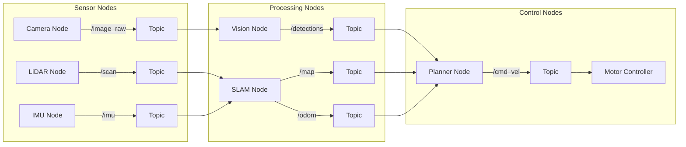

# Week 3: ROS 2 Architecture

## Learning Outcomes

By the end of this chapter, you should be able to:
- Explain the ROS 2 architecture and its role in robotics
- Understand the DDS (Data Distribution Service) middleware
- Create and run ROS 2 nodes using Python (rclpy)
- Implement publishers and subscribers for robot communication
- Use ROS 2 command-line tools for debugging

## The Physics (Why)

A humanoid robot is not a single program—it's a complex system of interconnected components:
- **Sensors** producing data at different rates
- **Controllers** running at high frequencies for stability
- **Planners** computing trajectories
- **Safety monitors** watching for dangerous conditions

These components must communicate reliably, in real-time, and often across multiple computers. **ROS 2** (Robot Operating System 2) provides the middleware that makes this possible.

Without ROS 2, you would need to:
- Write custom networking code for every component
- Handle message serialization manually
- Implement your own discovery mechanisms
- Build debugging and visualization tools from scratch

ROS 2 solves these problems with a standardized, battle-tested framework.

## The Analogy (Mental Model)

Think of ROS 2 like a **postal system** for robots:

- **Nodes** are like offices that send and receive mail
- **Topics** are like mailing addresses—anyone can send to or receive from an address
- **Messages** are like letters with standardized formats
- **Services** are like registered mail—you send a request and wait for a response
- **Actions** are like package tracking—long-running tasks with progress updates

The **DDS middleware** is like the postal infrastructure—it handles routing, delivery, and ensures messages arrive reliably.

## The Visualization (ROS 2 Graph)



## The Code (Implementation)

### Your First ROS 2 Node

```python
#!/usr/bin/env python3
"""
minimal_node.py - A minimal ROS 2 node demonstrating basic structure.

This node simply logs a message periodically to show the node lifecycle.
"""

import rclpy
from rclpy.node import Node


class MinimalNode(Node):
    """
    A minimal ROS 2 node that demonstrates the basic structure.
    
    All ROS 2 nodes inherit from rclpy.node.Node and must call
    the parent constructor with a unique node name.
    """
    
    def __init__(self):
        # Initialize the node with a unique name
        super().__init__('minimal_node')
        
        # Create a timer that fires every 1 second
        self.timer = self.create_timer(1.0, self.timer_callback)
        self.counter = 0
        
        # Log that the node has started
        self.get_logger().info('Minimal node has started!')
    
    def timer_callback(self):
        """Called every time the timer fires."""
        self.counter += 1
        self.get_logger().info(f'Timer fired {self.counter} times')


def main(args=None):
    """Main entry point for the node."""
    # Initialize the ROS 2 Python client library
    rclpy.init(args=args)
    
    # Create an instance of our node
    node = MinimalNode()
    
    try:
        # Spin the node so callbacks are called
        rclpy.spin(node)
    except KeyboardInterrupt:
        pass
    finally:
        # Clean up
        node.destroy_node()
        rclpy.shutdown()


if __name__ == '__main__':
    main()
```

### Publisher Node

```python
#!/usr/bin/env python3
"""
publisher_node.py - Publishes sensor data to a topic.

Demonstrates the publisher pattern in ROS 2.
"""

import rclpy
from rclpy.node import Node
from std_msgs.msg import Float64
from geometry_msgs.msg import Twist
import math


class SensorPublisher(Node):
    """
    Publishes simulated sensor data.
    
    In a real robot, this would read from actual hardware.
    """
    
    def __init__(self):
        super().__init__('sensor_publisher')
        
        # Create publishers for different data types
        # QoS depth of 10 means buffer up to 10 messages
        self.temperature_pub = self.create_publisher(
            Float64,           # Message type
            '/sensor/temperature',  # Topic name
            10                 # QoS depth
        )
        
        self.velocity_pub = self.create_publisher(
            Twist,
            '/cmd_vel',
            10
        )
        
        # Timer to publish at 10 Hz
        self.timer = self.create_timer(0.1, self.publish_data)
        self.time = 0.0
        
        self.get_logger().info('Sensor publisher started')
    
    def publish_data(self):
        """Publish sensor readings."""
        self.time += 0.1
        
        # Publish temperature (simulated sine wave)
        temp_msg = Float64()
        temp_msg.data = 25.0 + 5.0 * math.sin(self.time)
        self.temperature_pub.publish(temp_msg)
        
        # Publish velocity command
        vel_msg = Twist()
        vel_msg.linear.x = 0.5  # Forward at 0.5 m/s
        vel_msg.angular.z = 0.1 * math.sin(self.time)  # Gentle turning
        self.velocity_pub.publish(vel_msg)


def main(args=None):
    rclpy.init(args=args)
    node = SensorPublisher()
    
    try:
        rclpy.spin(node)
    except KeyboardInterrupt:
        pass
    finally:
        node.destroy_node()
        rclpy.shutdown()


if __name__ == '__main__':
    main()
```

### Subscriber Node

```python
#!/usr/bin/env python3
"""
subscriber_node.py - Subscribes to topics and processes data.

Demonstrates the subscriber pattern in ROS 2.
"""

import rclpy
from rclpy.node import Node
from std_msgs.msg import Float64
from geometry_msgs.msg import Twist


class DataSubscriber(Node):
    """
    Subscribes to sensor data and processes it.
    
    This pattern is used for monitoring, logging, and control.
    """
    
    def __init__(self):
        super().__init__('data_subscriber')
        
        # Subscribe to temperature
        self.temp_sub = self.create_subscription(
            Float64,
            '/sensor/temperature',
            self.temperature_callback,
            10
        )
        
        # Subscribe to velocity commands
        self.vel_sub = self.create_subscription(
            Twist,
            '/cmd_vel',
            self.velocity_callback,
            10
        )
        
        # Track statistics
        self.temp_readings = []
        self.max_speed = 0.0
        
        self.get_logger().info('Data subscriber started')
    
    def temperature_callback(self, msg: Float64):
        """Process temperature readings."""
        temp = msg.data
        self.temp_readings.append(temp)
        
        # Keep only last 100 readings
        if len(self.temp_readings) > 100:
            self.temp_readings.pop(0)
        
        # Calculate average
        avg_temp = sum(self.temp_readings) / len(self.temp_readings)
        
        # Log periodically
        if len(self.temp_readings) % 10 == 0:
            self.get_logger().info(
                f'Temperature: {temp:.1f}°C (avg: {avg_temp:.1f}°C)'
            )
    
    def velocity_callback(self, msg: Twist):
        """Process velocity commands."""
        speed = abs(msg.linear.x)
        
        if speed > self.max_speed:
            self.max_speed = speed
            self.get_logger().info(f'New max speed: {speed:.2f} m/s')


def main(args=None):
    rclpy.init(args=args)
    node = DataSubscriber()
    
    try:
        rclpy.spin(node)
    except KeyboardInterrupt:
        pass
    finally:
        node.destroy_node()
        rclpy.shutdown()


if __name__ == '__main__':
    main()
```

### ROS 2 Command-Line Tools

```bash
# List all running nodes
ros2 node list

# Get info about a specific node
ros2 node info /sensor_publisher

# List all topics
ros2 topic list

# Show topic message type
ros2 topic info /cmd_vel

# Echo messages on a topic (great for debugging)
ros2 topic echo /sensor/temperature

# Publish a test message
ros2 topic pub /cmd_vel geometry_msgs/msg/Twist \
  "{linear: {x: 0.5}, angular: {z: 0.1}}"

# Check publishing rate
ros2 topic hz /sensor/temperature
```

## The Hardware Reality (Warning)

:::warning Network Configuration
ROS 2 uses DDS for communication, which relies on multicast networking. Common issues:
- **Firewall blocking**: Disable firewall or add ROS 2 exceptions
- **Multiple network interfaces**: Set `ROS_DOMAIN_ID` to isolate traffic
- **Wi-Fi latency**: Use wired Ethernet for real-time control
:::

### Quality of Service (QoS) Settings

QoS determines how messages are delivered:

```python
from rclpy.qos import QoSProfile, ReliabilityPolicy, HistoryPolicy

# For sensor data: best effort, keep latest
sensor_qos = QoSProfile(
    reliability=ReliabilityPolicy.BEST_EFFORT,
    history=HistoryPolicy.KEEP_LAST,
    depth=1
)

# For commands: reliable delivery
command_qos = QoSProfile(
    reliability=ReliabilityPolicy.RELIABLE,
    history=HistoryPolicy.KEEP_LAST,
    depth=10
)
```

:::danger Real-Time Constraints
ROS 2 nodes run in user space and are not real-time by default. For safety-critical control:
- Use `ros2_control` with real-time controllers
- Consider running on a real-time Linux kernel (PREEMPT_RT)
- Keep control loops in dedicated high-priority threads
:::

## Assessment

### Recall

1. What is the role of DDS in ROS 2?
2. What is the difference between a topic and a service?
3. How do you create a timer in a ROS 2 node?
4. What command shows all active topics?

### Apply

1. Create a ROS 2 node that:
   - Subscribes to `/imu` (sensor_msgs/Imu)
   - Calculates the robot's tilt angle
   - Publishes a warning to `/safety/tilt_warning` if tilt > 15°

2. Write a launch file that starts both a publisher and subscriber node with configurable parameters.

3. Implement a node that logs all messages on `/cmd_vel` to a CSV file for later analysis.

### Analyze

1. Why might you choose `BEST_EFFORT` QoS for camera images but `RELIABLE` for emergency stop commands?

2. A robot has 10 sensor nodes each publishing at 100 Hz. Calculate the total message throughput and discuss potential bottlenecks.

3. Compare the trade-offs between using topics vs. services for robot arm position commands.
