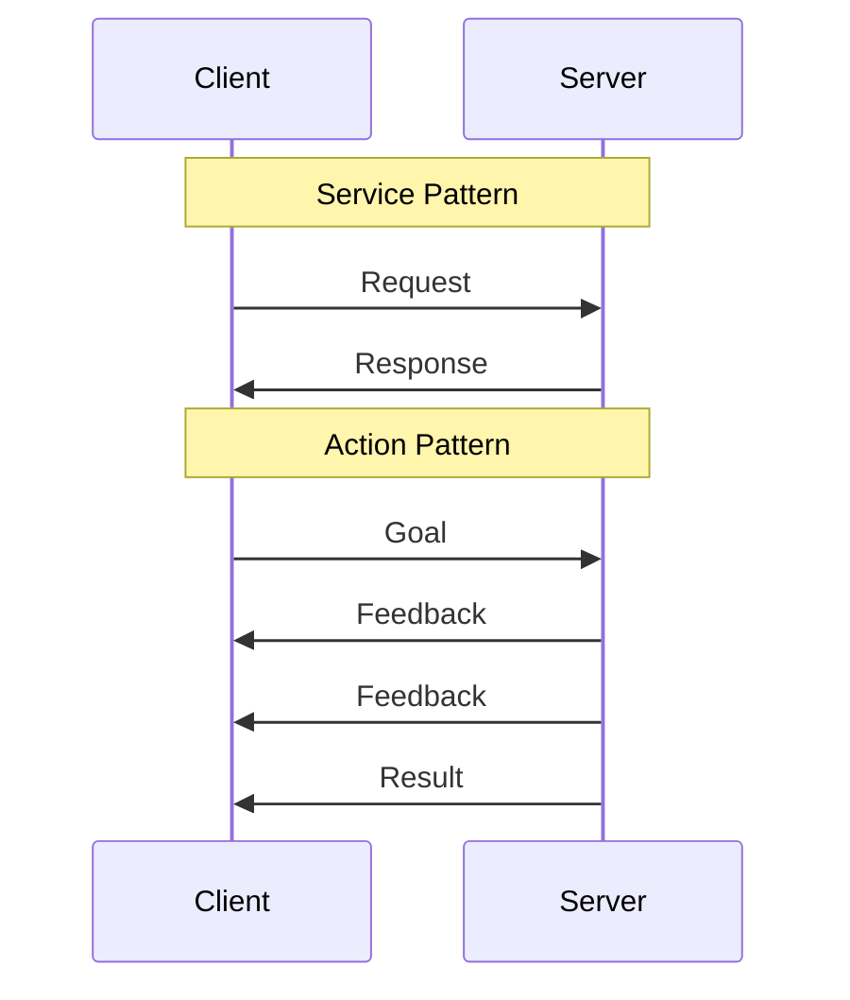

# Week 4: ROS 2 Communication Patterns

## Learning Outcomes

By the end of this chapter, you should be able to:
- Implement ROS 2 services for request-response communication
- Use actions for long-running tasks with feedback
- Choose the appropriate communication pattern for different scenarios
- Handle errors and timeouts in ROS 2 communication

## The Physics (Why)

Topics work well for continuous data streams, but robots also need:
- **Request-response**: "What is the current battery level?" → "85%"
- **Long-running tasks**: "Navigate to the kitchen" → progress updates → "Arrived"
- **Cancellable operations**: "Stop moving!" during navigation

ROS 2 provides **Services** and **Actions** for these patterns.

## The Analogy (Mental Model)

| Pattern | Real-World Analogy | Use Case |
|---------|-------------------|----------|
| **Topic** | Radio broadcast | Sensor data, continuous streams |
| **Service** | Phone call | Quick queries, configuration |
| **Action** | Food delivery app | Long tasks with tracking |

## The Visualization (Communication Patterns)



## The Code (Implementation)

### Service Server

```python
#!/usr/bin/env python3
"""
Service server for robot configuration queries.
"""

import rclpy
from rclpy.node import Node
from std_srvs.srv import SetBool, Trigger
from example_interfaces.srv import AddTwoInts


class RobotConfigService(Node):
    """Provides configuration services for the robot."""
    
    def __init__(self):
        super().__init__('robot_config_service')
        
        # Service to enable/disable motors
        self.motor_srv = self.create_service(
            SetBool,
            '/robot/enable_motors',
            self.enable_motors_callback
        )
        
        # Service to get robot status
        self.status_srv = self.create_service(
            Trigger,
            '/robot/get_status',
            self.get_status_callback
        )
        
        self.motors_enabled = False
        self.get_logger().info('Robot config service ready')
    
    def enable_motors_callback(
        self,
        request: SetBool.Request,
        response: SetBool.Response
    ) -> SetBool.Response:
        """Handle motor enable/disable requests."""
        self.motors_enabled = request.data
        
        response.success = True
        response.message = (
            'Motors enabled' if self.motors_enabled else 'Motors disabled'
        )
        
        self.get_logger().info(response.message)
        return response
    
    def get_status_callback(
        self,
        request: Trigger.Request,
        response: Trigger.Response
    ) -> Trigger.Response:
        """Return current robot status."""
        response.success = True
        response.message = f'Motors: {"ON" if self.motors_enabled else "OFF"}'
        return response


def main(args=None):
    rclpy.init(args=args)
    node = RobotConfigService()
    rclpy.spin(node)
    node.destroy_node()
    rclpy.shutdown()


if __name__ == '__main__':
    main()
```

### Service Client

```python
#!/usr/bin/env python3
"""
Service client demonstrating synchronous and async calls.
"""

import rclpy
from rclpy.node import Node
from std_srvs.srv import SetBool, Trigger


class RobotController(Node):
    """Controls robot via services."""
    
    def __init__(self):
        super().__init__('robot_controller')
        
        # Create service clients
        self.motor_client = self.create_client(
            SetBool,
            '/robot/enable_motors'
        )
        
        self.status_client = self.create_client(
            Trigger,
            '/robot/get_status'
        )
        
        # Wait for services to be available
        while not self.motor_client.wait_for_service(timeout_sec=1.0):
            self.get_logger().info('Waiting for motor service...')
    
    def enable_motors(self, enable: bool) -> bool:
        """Enable or disable motors (blocking call)."""
        request = SetBool.Request()
        request.data = enable
        
        future = self.motor_client.call_async(request)
        rclpy.spin_until_future_complete(self, future)
        
        result = future.result()
        self.get_logger().info(f'Motor service: {result.message}')
        return result.success
    
    def get_status(self) -> str:
        """Get robot status."""
        request = Trigger.Request()
        future = self.status_client.call_async(request)
        rclpy.spin_until_future_complete(self, future)
        return future.result().message


def main(args=None):
    rclpy.init(args=args)
    controller = RobotController()
    
    # Enable motors
    controller.enable_motors(True)
    
    # Check status
    status = controller.get_status()
    print(f'Robot status: {status}')
    
    controller.destroy_node()
    rclpy.shutdown()


if __name__ == '__main__':
    main()
```

### Action Server (Navigation Example)

```python
#!/usr/bin/env python3
"""
Action server for robot navigation with progress feedback.
"""

import time
import rclpy
from rclpy.node import Node
from rclpy.action import ActionServer, GoalResponse, CancelResponse
from rclpy.action.server import ServerGoalHandle
from example_interfaces.action import Fibonacci  # Using as placeholder


class NavigationServer(Node):
    """Handles navigation goals with feedback."""
    
    def __init__(self):
        super().__init__('navigation_server')
        
        self._action_server = ActionServer(
            self,
            Fibonacci,  # In real code: NavigateToPose
            'navigate',
            execute_callback=self.execute_callback,
            goal_callback=self.goal_callback,
            cancel_callback=self.cancel_callback
        )
        
        self.get_logger().info('Navigation server ready')
    
    def goal_callback(self, goal_request) -> GoalResponse:
        """Accept or reject incoming goals."""
        self.get_logger().info('Received navigation goal')
        return GoalResponse.ACCEPT
    
    def cancel_callback(self, goal_handle: ServerGoalHandle) -> CancelResponse:
        """Handle cancellation requests."""
        self.get_logger().info('Received cancel request')
        return CancelResponse.ACCEPT
    
    async def execute_callback(
        self,
        goal_handle: ServerGoalHandle
    ) -> Fibonacci.Result:
        """Execute the navigation goal with feedback."""
        self.get_logger().info('Executing navigation...')
        
        feedback_msg = Fibonacci.Feedback()
        
        # Simulate navigation progress
        for i in range(10):
            if goal_handle.is_cancel_requested:
                goal_handle.canceled()
                self.get_logger().info('Navigation canceled')
                return Fibonacci.Result()
            
            # Send progress feedback
            feedback_msg.partial_sequence = [i * 10]  # % complete
            goal_handle.publish_feedback(feedback_msg)
            self.get_logger().info(f'Progress: {i * 10}%')
            
            time.sleep(0.5)  # Simulate movement
        
        goal_handle.succeed()
        
        result = Fibonacci.Result()
        result.sequence = [100]  # Complete
        return result


def main(args=None):
    rclpy.init(args=args)
    node = NavigationServer()
    rclpy.spin(node)
    node.destroy_node()
    rclpy.shutdown()


if __name__ == '__main__':
    main()
```

## The Hardware Reality (Warning)

:::warning Service Timeouts
Services can hang if the server crashes. Always use timeouts:
```python
future = client.call_async(request)
rclpy.spin_until_future_complete(self, future, timeout_sec=5.0)
if not future.done():
    self.get_logger().error('Service call timed out!')
```
:::

:::danger Action Cancellation
Always implement proper cancellation handling. A robot that can't stop is dangerous!
:::

## Assessment

### Recall

1. When should you use a service vs. a topic?
2. What are the three components of an action (goal, feedback, result)?
3. How do you handle service timeouts?

### Apply

1. Create a service that returns the robot's battery percentage.
2. Implement an action server for a "pick and place" task with progress feedback.
3. Write a client that cancels navigation if battery drops below 20%.

### Analyze

1. Why are actions better than services for navigation tasks?
2. What happens if a service server crashes mid-request?
3. Design the communication architecture for a robot arm with 6 joints.
