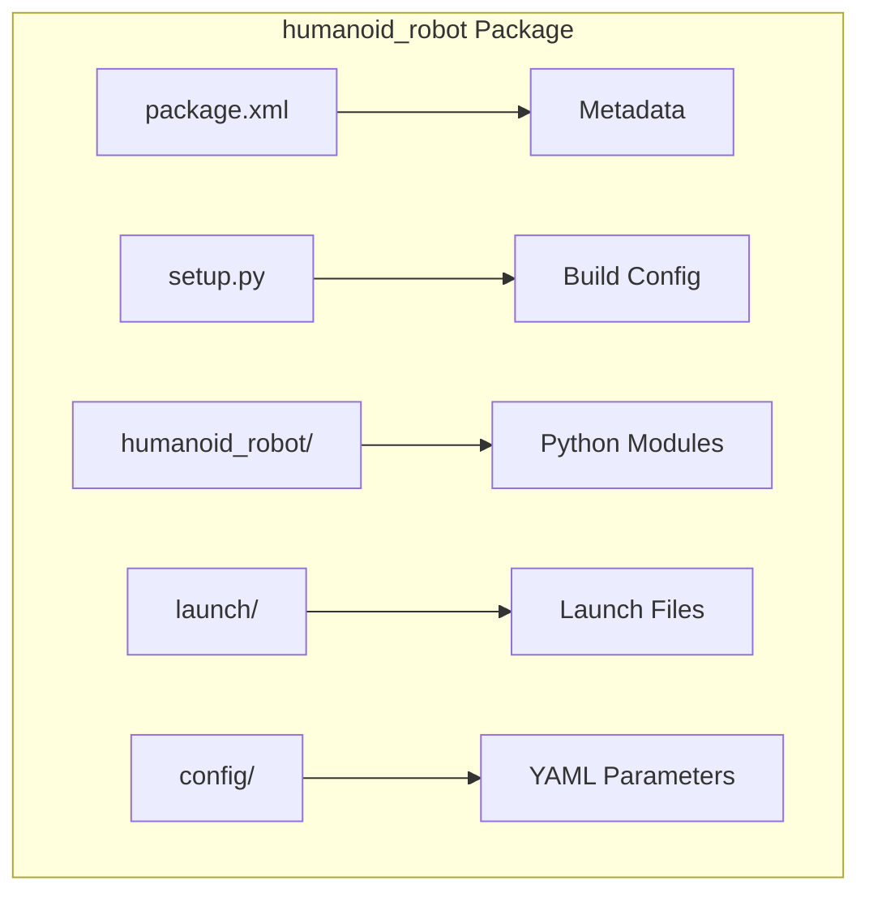

# Week 5: ROS 2 Packages and Launch Files

## Learning Outcomes

By the end of this chapter, you should be able to:
- Create and build ROS 2 Python packages
- Write launch files to start multiple nodes
- Configure nodes with parameters and YAML files
- Organize a complete robot software stack

## The Physics (Why)

A humanoid robot runs dozens of nodes simultaneously. Starting each manually is impractical. **Launch files** automate this process, while **packages** organize code into reusable modules.

## The Analogy (Mental Model)

- **Package** = A library or app (self-contained, reusable)
- **Launch file** = A startup script (orchestrates multiple programs)
- **Parameters** = Configuration settings (adjustable without recompiling)

## The Visualization (Package Structure)



## The Code (Implementation)

### Package Structure

```bash
humanoid_control/
├── package.xml              # Package metadata
├── setup.py                 # Python build configuration
├── setup.cfg                # Entry points config
├── resource/
│   └── humanoid_control     # Marker file
├── humanoid_control/        # Python package
│   ├── __init__.py
│   ├── balance_controller.py
│   ├── gait_generator.py
│   └── safety_monitor.py
├── launch/
│   └── humanoid_bringup.launch.py
└── config/
    └── robot_params.yaml
```

### package.xml

```xml
<?xml version="1.0"?>
<package format="3">
  <name>humanoid_control</name>
  <version>1.0.0</version>
  <description>Humanoid robot control package</description>
  <maintainer email="dev@example.com">Developer</maintainer>
  <license>MIT</license>

  <depend>rclpy</depend>
  <depend>std_msgs</depend>
  <depend>geometry_msgs</depend>
  <depend>sensor_msgs</depend>

  <export>
    <build_type>ament_python</build_type>
  </export>
</package>
```

### setup.py

```python
from setuptools import setup
import os
from glob import glob

package_name = 'humanoid_control'

setup(
    name=package_name,
    version='1.0.0',
    packages=[package_name],
    data_files=[
        ('share/ament_index/resource_index/packages',
            ['resource/' + package_name]),
        ('share/' + package_name, ['package.xml']),
        (os.path.join('share', package_name, 'launch'),
            glob('launch/*.launch.py')),
        (os.path.join('share', package_name, 'config'),
            glob('config/*.yaml')),
    ],
    install_requires=['setuptools'],
    entry_points={
        'console_scripts': [
            'balance_controller = humanoid_control.balance_controller:main',
            'gait_generator = humanoid_control.gait_generator:main',
            'safety_monitor = humanoid_control.safety_monitor:main',
        ],
    },
)
```

### Launch File

```python
#!/usr/bin/env python3
"""
humanoid_bringup.launch.py - Launch all humanoid control nodes.
"""

from launch import LaunchDescription
from launch_ros.actions import Node
from launch.actions import DeclareLaunchArgument
from launch.substitutions import LaunchConfiguration
from ament_index_python.packages import get_package_share_directory
import os


def generate_launch_description():
    # Get package directory
    pkg_dir = get_package_share_directory('humanoid_control')
    
    # Declare arguments
    use_sim = DeclareLaunchArgument(
        'use_sim',
        default_value='true',
        description='Use simulation time'
    )
    
    # Load parameters
    params_file = os.path.join(pkg_dir, 'config', 'robot_params.yaml')
    
    # Define nodes
    balance_node = Node(
        package='humanoid_control',
        executable='balance_controller',
        name='balance_controller',
        parameters=[params_file, {'use_sim_time': LaunchConfiguration('use_sim')}],
        output='screen'
    )
    
    gait_node = Node(
        package='humanoid_control',
        executable='gait_generator',
        name='gait_generator',
        parameters=[params_file],
        output='screen'
    )
    
    safety_node = Node(
        package='humanoid_control',
        executable='safety_monitor',
        name='safety_monitor',
        parameters=[{'max_tilt': 0.5, 'max_force': 100.0}],
        output='screen'
    )
    
    return LaunchDescription([
        use_sim,
        balance_node,
        gait_node,
        safety_node,
    ])
```

### Parameter YAML

```yaml
# robot_params.yaml
balance_controller:
  ros__parameters:
    control_frequency: 1000.0  # Hz
    kp_roll: 100.0
    kd_roll: 10.0
    kp_pitch: 100.0
    kd_pitch: 10.0
    max_correction: 0.1  # radians

gait_generator:
  ros__parameters:
    step_height: 0.05  # meters
    step_length: 0.3   # meters
    cycle_time: 0.8    # seconds
    double_support_ratio: 0.2
```

### Node with Parameters

```python
#!/usr/bin/env python3
"""
balance_controller.py - Uses parameters from YAML.
"""

import rclpy
from rclpy.node import Node
from rcl_interfaces.msg import ParameterDescriptor


class BalanceController(Node):
    def __init__(self):
        super().__init__('balance_controller')
        
        # Declare parameters with descriptions
        self.declare_parameter(
            'control_frequency',
            1000.0,
            ParameterDescriptor(description='Control loop frequency in Hz')
        )
        self.declare_parameter('kp_roll', 100.0)
        self.declare_parameter('kd_roll', 10.0)
        
        # Get parameter values
        freq = self.get_parameter('control_frequency').value
        self.kp = self.get_parameter('kp_roll').value
        self.kd = self.get_parameter('kd_roll').value
        
        # Create timer at specified frequency
        period = 1.0 / freq
        self.timer = self.create_timer(period, self.control_loop)
        
        self.get_logger().info(
            f'Balance controller started at {freq} Hz, Kp={self.kp}, Kd={self.kd}'
        )
    
    def control_loop(self):
        # Control logic here
        pass


def main(args=None):
    rclpy.init(args=args)
    node = BalanceController()
    rclpy.spin(node)
    node.destroy_node()
    rclpy.shutdown()


if __name__ == '__main__':
    main()
```

### Build and Run

```bash
# Build the package
cd ~/ros2_ws
colcon build --packages-select humanoid_control

# Source the workspace
source install/setup.bash

# Launch all nodes
ros2 launch humanoid_control humanoid_bringup.launch.py

# Launch with arguments
ros2 launch humanoid_control humanoid_bringup.launch.py use_sim:=false

# Change parameters at runtime
ros2 param set /balance_controller kp_roll 150.0
```

## The Hardware Reality (Warning)

:::warning Build Dependencies
Always declare all dependencies in `package.xml`. Missing dependencies cause cryptic build failures on other machines.
:::

:::tip Parameter Best Practices
- Use YAML files for complex configurations
- Declare all parameters with descriptors
- Provide sensible defaults
- Document units in parameter names or descriptions
:::

## Assessment

### Recall

1. What files are required in a ROS 2 Python package?
2. How do you pass parameters to a node in a launch file?
3. What command builds a specific package?

### Apply

1. Create a package with two nodes that communicate via a topic.
2. Write a launch file that starts nodes with different parameter files for simulation vs. real robot.
3. Implement dynamic parameter updates that take effect without restarting the node.

### Analyze

1. How would you organize packages for a humanoid robot with arms, legs, and a head?
2. What are the trade-offs between hardcoded values vs. parameters?
3. Design a parameter hierarchy for a robot with multiple operating modes (walking, running, climbing).
