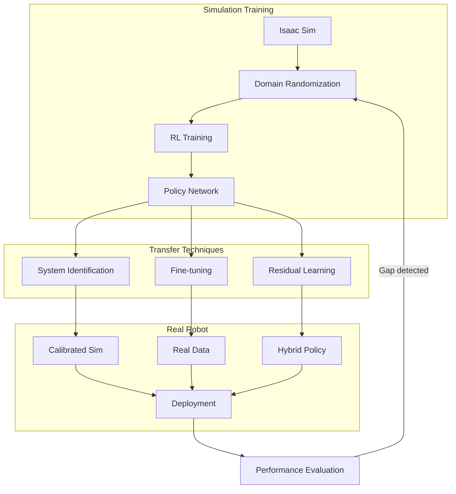

# Sim-to-Real Transfer

## Learning Outcomes

By the end of this chapter, you should be able to:
- Understand the reality gap and why sim-to-real transfer is challenging
- Implement domain randomization to improve model robustness
- Train reinforcement learning policies in simulation
- Deploy simulation-trained models to real robots
- Evaluate and debug sim-to-real transfer failures

## The Physics (Why)

The **reality gap** is the difference between simulated and real-world physics. Simulators make approximations:
- **Friction**: Real friction is complex (static vs. dynamic, surface variations)
- **Contact dynamics**: Real collisions involve deformation, vibration
- **Actuator dynamics**: Real motors have delays, backlash, temperature effects
- **Sensor noise**: Real sensors have noise patterns simulators can't perfectly model

A policy trained in simulation may fail catastrophically on a real robot because it learned to exploit simulator quirks rather than robust physical principles.

## The Analogy (Mental Model)

Think of sim-to-real transfer like **learning to drive in a video game, then driving a real car**:

| Video Game | Real World |
|------------|------------|
| Perfect traction | Ice, gravel, wet roads |
| Instant response | Steering delay, brake fade |
| No consequences | Accidents cause damage |
| Reset on failure | No respawns |

To succeed, you need to:
1. **Train with variety**: Different weather, road conditions
2. **Add noise**: Imperfect controls, sensor lag
3. **Be conservative**: Don't rely on perfect physics

## The Visualization (Sim-to-Real Pipeline)



## The Code (Implementation)

### Domain Randomization

```python
#!/usr/bin/env python3
"""
domain_randomization.py - Randomize simulation parameters for robust training.
"""

import numpy as np
from dataclasses import dataclass
from typing import Dict, Tuple
import random


@dataclass
class RandomizationConfig:
    """Configuration for domain randomization."""
    # Physics parameters
    friction_range: Tuple[float, float] = (0.5, 1.5)
    mass_scale_range: Tuple[float, float] = (0.8, 1.2)
    motor_strength_range: Tuple[float, float] = (0.9, 1.1)
    
    # Sensor noise
    observation_noise_std: float = 0.01
    action_delay_range: Tuple[int, int] = (0, 3)  # frames
    
    # Visual randomization
    lighting_range: Tuple[float, float] = (0.5, 1.5)
    texture_randomization: bool = True


class DomainRandomizer:
    """Apply domain randomization to simulation."""
    
    def __init__(self, config: RandomizationConfig):
        self.config = config
        self.current_params = {}
    
    def randomize_physics(self) -> Dict[str, float]:
        """Randomize physics parameters."""
        params = {
            'friction': np.random.uniform(*self.config.friction_range),
            'mass_scale': np.random.uniform(*self.config.mass_scale_range),
            'motor_strength': np.random.uniform(*self.config.motor_strength_range),
        }
        self.current_params.update(params)
        return params
    
    def add_observation_noise(self, obs: np.ndarray) -> np.ndarray:
        """Add noise to observations."""
        noise = np.random.normal(0, self.config.observation_noise_std, obs.shape)
        return obs + noise
    
    def apply_action_delay(self, action: np.ndarray, action_buffer: list) -> np.ndarray:
        """Apply random action delay."""
        delay = np.random.randint(*self.config.action_delay_range)
        action_buffer.append(action)
        
        if len(action_buffer) > delay:
            return action_buffer.pop(0)
        return np.zeros_like(action)
    
    def randomize_visual(self) -> Dict[str, float]:
        """Randomize visual parameters."""
        params = {
            'lighting_intensity': np.random.uniform(*self.config.lighting_range),
            'texture_id': random.randint(0, 100) if self.config.texture_randomization else 0,
        }
        self.current_params.update(params)
        return params


class RobustTrainingEnv:
    """Training environment with domain randomization."""
    
    def __init__(self, base_env, randomizer: DomainRandomizer):
        self.base_env = base_env
        self.randomizer = randomizer
        self.action_buffer = []
        self.episode_count = 0
    
    def reset(self):
        """Reset environment with new randomization."""
        self.episode_count += 1
        self.action_buffer = []
        
        # Randomize at start of each episode
        physics_params = self.randomizer.randomize_physics()
        visual_params = self.randomizer.randomize_visual()
        
        # Apply to simulation (implementation depends on simulator)
        self.apply_randomization(physics_params, visual_params)
        
        obs = self.base_env.reset()
        return self.randomizer.add_observation_noise(obs)
    
    def step(self, action):
        """Step with randomization applied."""
        # Apply action delay
        delayed_action = self.randomizer.apply_action_delay(
            action, self.action_buffer
        )
        
        obs, reward, done, info = self.base_env.step(delayed_action)
        
        # Add observation noise
        noisy_obs = self.randomizer.add_observation_noise(obs)
        
        return noisy_obs, reward, done, info
    
    def apply_randomization(self, physics_params, visual_params):
        """Apply randomization to simulator."""
        # Implementation depends on specific simulator
        pass
```

### Reinforcement Learning Training

```python
#!/usr/bin/env python3
"""
rl_training.py - Train walking policy with PPO.
"""

import numpy as np
import torch
import torch.nn as nn
from typing import Tuple


class WalkingPolicy(nn.Module):
    """Neural network policy for humanoid walking."""
    
    def __init__(self, obs_dim: int, action_dim: int, hidden_dim: int = 256):
        super().__init__()
        
        # Actor network (policy)
        self.actor = nn.Sequential(
            nn.Linear(obs_dim, hidden_dim),
            nn.ReLU(),
            nn.Linear(hidden_dim, hidden_dim),
            nn.ReLU(),
            nn.Linear(hidden_dim, action_dim),
            nn.Tanh()  # Actions in [-1, 1]
        )
        
        # Critic network (value function)
        self.critic = nn.Sequential(
            nn.Linear(obs_dim, hidden_dim),
            nn.ReLU(),
            nn.Linear(hidden_dim, hidden_dim),
            nn.ReLU(),
            nn.Linear(hidden_dim, 1)
        )
        
        # Log standard deviation for action distribution
        self.log_std = nn.Parameter(torch.zeros(action_dim))
    
    def forward(self, obs: torch.Tensor) -> Tuple[torch.Tensor, torch.Tensor]:
        """Get action mean and value estimate."""
        action_mean = self.actor(obs)
        value = self.critic(obs)
        return action_mean, value
    
    def get_action(self, obs: torch.Tensor, deterministic: bool = False):
        """Sample action from policy."""
        action_mean, _ = self.forward(obs)
        
        if deterministic:
            return action_mean
        
        std = torch.exp(self.log_std)
        dist = torch.distributions.Normal(action_mean, std)
        action = dist.sample()
        
        return action, dist.log_prob(action).sum(-1)


class WalkingReward:
    """Reward function for humanoid walking."""
    
    def __init__(self):
        # Reward weights
        self.forward_weight = 1.0
        self.alive_bonus = 0.1
        self.energy_penalty = 0.01
        self.stability_weight = 0.5
    
    def compute(
        self,
        velocity: np.ndarray,
        joint_torques: np.ndarray,
        orientation: np.ndarray,
        is_fallen: bool
    ) -> float:
        """Compute reward for current state."""
        if is_fallen:
            return -10.0  # Large penalty for falling
        
        # Forward velocity reward
        forward_reward = self.forward_weight * velocity[0]
        
        # Alive bonus
        alive_reward = self.alive_bonus
        
        # Energy penalty (encourage efficient movement)
        energy_penalty = self.energy_penalty * np.sum(joint_torques ** 2)
        
        # Stability reward (upright orientation)
        # orientation is roll, pitch, yaw
        stability_reward = self.stability_weight * (
            1.0 - abs(orientation[0]) - abs(orientation[1])
        )
        
        total_reward = forward_reward + alive_reward - energy_penalty + stability_reward
        
        return total_reward


# Training loop (simplified)
def train_walking_policy(env, policy, num_episodes=1000):
    """Train walking policy with PPO."""
    optimizer = torch.optim.Adam(policy.parameters(), lr=3e-4)
    reward_fn = WalkingReward()
    
    for episode in range(num_episodes):
        obs = env.reset()
        episode_reward = 0
        
        while True:
            obs_tensor = torch.FloatTensor(obs).unsqueeze(0)
            action, log_prob = policy.get_action(obs_tensor)
            
            next_obs, _, done, info = env.step(action.numpy().flatten())
            
            # Compute custom reward
            reward = reward_fn.compute(
                velocity=info.get('velocity', np.zeros(3)),
                joint_torques=info.get('torques', np.zeros(12)),
                orientation=info.get('orientation', np.zeros(3)),
                is_fallen=info.get('fallen', False)
            )
            
            episode_reward += reward
            obs = next_obs
            
            if done:
                break
        
        if episode % 100 == 0:
            print(f"Episode {episode}: Reward = {episode_reward:.2f}")
```

### Deployment to Real Robot

```python
#!/usr/bin/env python3
"""
real_robot_deployment.py - Deploy trained policy to real robot.
"""

import rclpy
from rclpy.node import Node
from sensor_msgs.msg import JointState, Imu
from std_msgs.msg import Float64MultiArray
import torch
import numpy as np


class RealRobotController(Node):
    """Deploy simulation-trained policy to real robot."""
    
    def __init__(self, policy_path: str):
        super().__init__('real_robot_controller')
        
        # Load trained policy
        self.policy = torch.load(policy_path)
        self.policy.eval()
        
        # State buffers
        self.joint_positions = np.zeros(12)
        self.joint_velocities = np.zeros(12)
        self.imu_orientation = np.zeros(4)
        self.imu_angular_vel = np.zeros(3)
        
        # Subscribers
        self.joint_sub = self.create_subscription(
            JointState, '/joint_states', self.joint_callback, 10
        )
        self.imu_sub = self.create_subscription(
            Imu, '/imu', self.imu_callback, 10
        )
        
        # Publisher for joint commands
        self.cmd_pub = self.create_publisher(
            Float64MultiArray, '/joint_commands', 10
        )
        
        # Control loop at 100 Hz
        self.timer = self.create_timer(0.01, self.control_loop)
        
        # Safety limits
        self.max_joint_velocity = 2.0  # rad/s
        self.max_torque = 50.0  # Nm
        
        self.get_logger().info('Real robot controller started')
    
    def joint_callback(self, msg: JointState):
        """Update joint state from robot."""
        self.joint_positions = np.array(msg.position[:12])
        self.joint_velocities = np.array(msg.velocity[:12])
    
    def imu_callback(self, msg: Imu):
        """Update IMU state from robot."""
        self.imu_orientation = np.array([
            msg.orientation.x, msg.orientation.y,
            msg.orientation.z, msg.orientation.w
        ])
        self.imu_angular_vel = np.array([
            msg.angular_velocity.x,
            msg.angular_velocity.y,
            msg.angular_velocity.z
        ])
    
    def build_observation(self) -> np.ndarray:
        """Build observation vector matching training."""
        obs = np.concatenate([
            self.joint_positions,
            self.joint_velocities,
            self.imu_orientation,
            self.imu_angular_vel
        ])
        return obs
    
    def control_loop(self):
        """Main control loop."""
        # Build observation
        obs = self.build_observation()
        obs_tensor = torch.FloatTensor(obs).unsqueeze(0)
        
        # Get action from policy
        with torch.no_grad():
            action = self.policy.get_action(obs_tensor, deterministic=True)
        
        action = action.numpy().flatten()
        
        # Apply safety limits
        action = self.apply_safety_limits(action)
        
        # Publish command
        cmd_msg = Float64MultiArray()
        cmd_msg.data = action.tolist()
        self.cmd_pub.publish(cmd_msg)
    
    def apply_safety_limits(self, action: np.ndarray) -> np.ndarray:
        """Apply safety limits to actions."""
        # Clip to safe range
        action = np.clip(action, -1.0, 1.0)
        
        # Scale to actual joint limits
        # (depends on robot configuration)
        
        return action


def main(args=None):
    rclpy.init(args=args)
    controller = RealRobotController('walking_policy.pt')
    rclpy.spin(controller)
    controller.destroy_node()
    rclpy.shutdown()


if __name__ == '__main__':
    main()
```

## The Hardware Reality (Warning)

:::danger Sim-to-Real Failures
Common failure modes when deploying to real robots:
- **Actuator saturation**: Real motors can't match simulated torques
- **Sensor delays**: Real sensors have latency simulation ignores
- **Unmodeled dynamics**: Cable drag, joint friction, thermal effects
- **Environmental differences**: Floor texture, lighting, obstacles

Always start with conservative policies and gradually increase aggressiveness.
:::

:::warning Testing Protocol
Before full deployment:
1. **Desk test**: Run policy with robot suspended
2. **Harness test**: Robot on safety harness
3. **Slow motion**: Run at 50% speed
4. **Supervised**: Human ready to catch/stop
5. **Full speed**: Only after all above pass
:::

### Debugging Sim-to-Real Gaps

| Symptom | Likely Cause | Solution |
|---------|--------------|----------|
| Falls immediately | Friction mismatch | Increase friction randomization |
| Drifts sideways | IMU calibration | Calibrate real IMU, add bias randomization |
| Jerky motion | Action delay | Add delay randomization in training |
| Overheats motors | Torque limits | Add energy penalty, reduce action scale |

## Assessment

### Recall

1. What is the reality gap and why does it exist?
2. Name three types of domain randomization.
3. What is the purpose of adding observation noise during training?
4. Why should you start with conservative policies on real robots?

### Apply

1. Implement domain randomization for friction and mass in a simple simulation.
2. Design a reward function for a humanoid robot that encourages stable walking.
3. Write a safety wrapper that limits joint velocities and torques.

### Analyze

1. Compare the trade-offs between domain randomization and system identification.
2. Why might a policy that works well in simulation with randomization still fail on a real robot?
3. Design an experiment to identify which simulation parameters most affect real-world performance.
