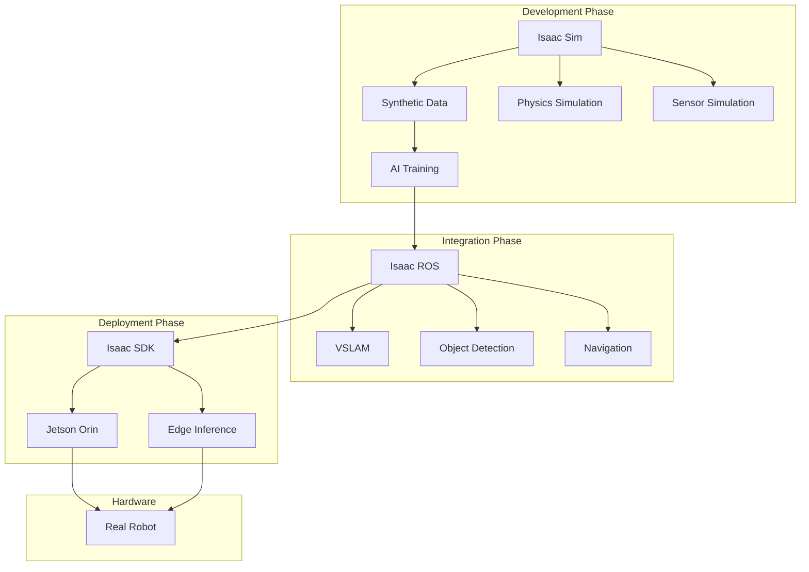

# NVIDIA Isaac Platform

## Learning Outcomes

By the end of this chapter, you should be able to:
- Understand the NVIDIA Isaac ecosystem and its components
- Set up Isaac Sim for robot simulation
- Use Isaac ROS for hardware-accelerated perception
- Implement basic navigation with Nav2
- Recognize hardware requirements for Isaac development

## The Physics (Why)

Traditional robotics software runs on CPUs, processing sensor data sequentially. But modern robots generate massive amounts of data:
- **Cameras**: 30+ frames per second at 1080p = 186 MB/s
- **LiDAR**: 300,000+ points per second = 3.6 MB/s
- **Neural networks**: Billions of operations per inference

**GPUs** solve this through massive parallelism—thousands of cores processing data simultaneously. NVIDIA Isaac leverages this for:
- **Real-time perception**: Process camera feeds at full frame rate
- **Physics simulation**: Simulate thousands of collision checks in parallel
- **AI inference**: Run complex neural networks in milliseconds

This is why Isaac can achieve what CPU-only solutions cannot: real-time AI-powered robotics.

## The Analogy (Mental Model)

Think of the Isaac ecosystem as a **robot development factory**:

| Component | Factory Analogy | Purpose |
|-----------|-----------------|---------|
| **Isaac Sim** | Test facility | Safe environment to test robots before deployment |
| **Isaac ROS** | Assembly line | Production-ready perception and navigation |
| **Isaac SDK** | Shipping department | Deploy to edge devices (Jetson) |

Just as a car manufacturer wouldn't test a new vehicle on public roads, roboticists use Isaac Sim to validate algorithms before real-world deployment.

## The Visualization (System Architecture)



## The Code (Implementation)

### Isaac Sim Setup

```bash
# Install Isaac Sim via Omniverse Launcher
# 1. Download Omniverse Launcher from NVIDIA
# 2. Install Isaac Sim from the Exchange tab
# 3. Launch Isaac Sim

# Verify installation
cd ~/.local/share/ov/pkg/isaac_sim-*/
./isaac-sim.sh --help

# Launch with ROS 2 bridge
./isaac-sim.sh --enable-ros2-bridge
```

### Isaac ROS VSLAM Example

```python
#!/usr/bin/env python3
"""
isaac_vslam_node.py - Visual SLAM with Isaac ROS.
Demonstrates GPU-accelerated localization.
"""

import rclpy
from rclpy.node import Node
from nav_msgs.msg import Odometry
from sensor_msgs.msg import Image, CameraInfo
from geometry_msgs.msg import PoseStamped


class IsaacVSLAMMonitor(Node):
    """Monitor Isaac ROS VSLAM output."""
    
    def __init__(self):
        super().__init__('isaac_vslam_monitor')
        
        # Subscribe to VSLAM odometry
        self.odom_sub = self.create_subscription(
            Odometry,
            '/visual_slam/tracking/odometry',
            self.odom_callback,
            10
        )
        
        # Track pose history
        self.pose_history = []
        self.tracking_status = 'initializing'
        
        self.get_logger().info('Isaac VSLAM Monitor started')
    
    def odom_callback(self, msg: Odometry):
        """Process VSLAM odometry updates."""
        pose = msg.pose.pose
        
        # Extract position
        x = pose.position.x
        y = pose.position.y
        z = pose.position.z
        
        # Store pose
        self.pose_history.append((x, y, z))
        
        # Calculate travel distance
        if len(self.pose_history) > 1:
            prev = self.pose_history[-2]
            dist = ((x - prev[0])**2 + (y - prev[1])**2)**0.5
            
            if dist > 0.01:  # Moving
                self.tracking_status = 'tracking'
            else:
                self.tracking_status = 'stationary'
        
        self.get_logger().info(
            f'Position: ({x:.2f}, {y:.2f}, {z:.2f}) - {self.tracking_status}'
        )


def main(args=None):
    rclpy.init(args=args)
    node = IsaacVSLAMMonitor()
    rclpy.spin(node)
    node.destroy_node()
    rclpy.shutdown()


if __name__ == '__main__':
    main()
```

### Nav2 Integration

```python
#!/usr/bin/env python3
"""
nav2_commander.py - Navigation with Nav2.
"""

import rclpy
from rclpy.node import Node
from geometry_msgs.msg import PoseStamped
from nav2_simple_commander.robot_navigator import BasicNavigator, TaskResult


class HumanoidNavigator(Node):
    """Navigate humanoid robot using Nav2."""
    
    def __init__(self):
        super().__init__('humanoid_navigator')
        self.navigator = BasicNavigator()
        
        # Wait for Nav2 to be ready
        self.navigator.waitUntilNav2Active()
        self.get_logger().info('Nav2 is ready')
    
    def go_to_pose(self, x: float, y: float, yaw: float = 0.0):
        """Navigate to a specific pose."""
        goal = PoseStamped()
        goal.header.frame_id = 'map'
        goal.header.stamp = self.get_clock().now().to_msg()
        
        goal.pose.position.x = x
        goal.pose.position.y = y
        goal.pose.position.z = 0.0
        
        # Convert yaw to quaternion (simplified)
        import math
        goal.pose.orientation.z = math.sin(yaw / 2)
        goal.pose.orientation.w = math.cos(yaw / 2)
        
        self.get_logger().info(f'Navigating to ({x}, {y})')
        self.navigator.goToPose(goal)
        
        # Wait for completion
        while not self.navigator.isTaskComplete():
            feedback = self.navigator.getFeedback()
            if feedback:
                self.get_logger().info(
                    f'Distance remaining: {feedback.distance_remaining:.2f}m'
                )
        
        result = self.navigator.getResult()
        if result == TaskResult.SUCCEEDED:
            self.get_logger().info('Navigation succeeded!')
        else:
            self.get_logger().error(f'Navigation failed: {result}')
        
        return result == TaskResult.SUCCEEDED


def main(args=None):
    rclpy.init(args=args)
    nav = HumanoidNavigator()
    
    # Example: Navigate to kitchen
    nav.go_to_pose(x=5.0, y=2.0, yaw=1.57)
    
    nav.destroy_node()
    rclpy.shutdown()


if __name__ == '__main__':
    main()
```

## The Hardware Reality (Warning)

:::danger Hardware Requirements
Isaac Sim and Isaac ROS have significant hardware requirements:

**Isaac Sim (Development Workstation):**
- **GPU**: NVIDIA RTX 4070 Ti or higher (12GB+ VRAM)
- **CPU**: Intel i7/AMD Ryzen 7 or higher
- **RAM**: 64GB recommended (32GB minimum)
- **Storage**: 500GB+ SSD (Isaac Sim is ~30GB)
- **OS**: Ubuntu 22.04 LTS

**Isaac ROS (Edge Deployment):**
- **Jetson Orin Nano**: Entry-level, limited models
- **Jetson Orin NX**: Recommended for most applications
- **Jetson AGX Orin**: Full Isaac ROS capabilities
:::

:::warning GPU Memory Constraints
Running Isaac Sim with complex scenes can exhaust GPU memory:
- **8GB VRAM**: Simple scenes, single robot
- **12GB VRAM**: Medium complexity, basic AI
- **24GB+ VRAM**: Full synthetic data generation, multiple robots
:::

### Isaac ROS Hardware Acceleration

| Component | Technology | Speedup vs CPU |
|-----------|------------|----------------|
| Image Processing | CUDA | 10-50x |
| DNN Inference | TensorRT | 5-20x |
| Stereo Matching | VPI | 20-100x |
| SLAM | cuVSLAM | 10-30x |

### Cloud Alternatives

If you don't have RTX hardware:

| Service | Cost | Use Case |
|---------|------|----------|
| AWS g5.2xlarge | ~$1.21/hr | Isaac Sim development |
| Azure NC6s_v3 | ~$0.90/hr | Isaac ROS testing |
| Google Cloud T4 | ~$0.35/hr | Basic inference |

## Assessment

### Recall

1. What are the three main components of the NVIDIA Isaac ecosystem?
2. Why does Isaac use GPU acceleration instead of CPU-only processing?
3. What is the minimum GPU requirement for Isaac Sim?
4. What does VSLAM stand for and what does it do?

### Apply

1. Set up Isaac Sim and spawn a simple robot in an empty world.
2. Write a ROS 2 node that subscribes to Isaac ROS VSLAM odometry and logs the robot's position.
3. Configure Nav2 to navigate a robot to three waypoints in sequence.

### Analyze

1. Compare the trade-offs between running Isaac Sim locally vs. in the cloud.
2. Why might GPU-accelerated perception be essential for humanoid robots but optional for slow-moving warehouse robots?
3. Design a development workflow that uses Isaac Sim for training and Gazebo for quick iteration. When would you use each?
