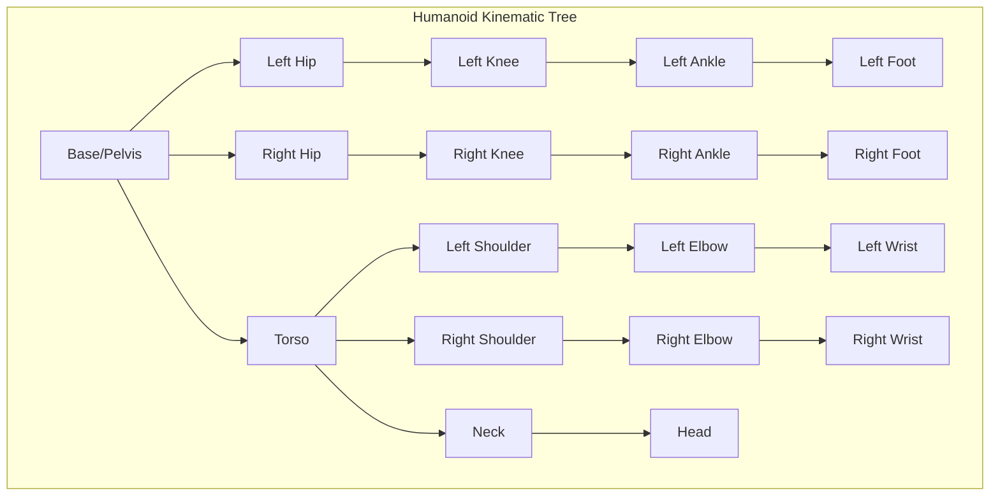

# Humanoid Kinematics and Dynamics

## Learning Outcomes

By the end of this chapter, you should be able to:
- Understand forward and inverse kinematics for humanoid robots
- Explain the challenges of bipedal locomotion
- Implement basic balance control using the Zero Moment Point (ZMP)
- Design kinematic chains for humanoid limbs
- Calculate joint trajectories for walking gaits

## The Physics (Why)

Humanoid robots are among the most complex mechanical systems ever built. A typical humanoid has 20-40 degrees of freedom (DOF), each requiring precise coordination.

**Kinematics** answers: "Given joint angles, where is the end effector?"
**Inverse Kinematics** answers: "Given a desired end effector position, what joint angles achieve it?"
**Dynamics** answers: "What forces and torques are needed to achieve desired motion?"

For bipedal robots, the challenge is even greater:
- **Underactuation**: The robot can fall—gravity is always acting
- **Contact switching**: Support alternates between feet
- **Balance**: Center of mass must stay over the support polygon
- **Compliance**: Joints must absorb impacts during walking

## The Analogy (Mental Model)

Think of a humanoid robot like a **marionette puppet**:
- **Strings** = Joint actuators (motors)
- **Wooden parts** = Rigid links (limbs)
- **Puppeteer** = Control system

But unlike a puppet, a humanoid must:
1. **Balance itself** (no strings from above)
2. **React to disturbances** (someone bumps into it)
3. **Plan its own movements** (no puppeteer)

The control system must be both the puppeteer AND the puppet's brain.

## The Visualization (Kinematic Chain)



## The Code (Implementation)

### Forward Kinematics

```python
#!/usr/bin/env python3
"""
forward_kinematics.py - Calculate end effector position from joint angles.
"""

import numpy as np
from dataclasses import dataclass
from typing import List, Tuple


@dataclass
class DHParameters:
    """Denavit-Hartenberg parameters for a joint."""
    theta: float  # Joint angle (radians)
    d: float      # Link offset
    a: float      # Link length
    alpha: float  # Link twist


def dh_transform(params: DHParameters) -> np.ndarray:
    """
    Compute transformation matrix from DH parameters.
    
    Args:
        params: DH parameters for the joint
        
    Returns:
        4x4 homogeneous transformation matrix
    """
    ct = np.cos(params.theta)
    st = np.sin(params.theta)
    ca = np.cos(params.alpha)
    sa = np.sin(params.alpha)
    
    return np.array([
        [ct, -st * ca,  st * sa, params.a * ct],
        [st,  ct * ca, -ct * sa, params.a * st],
        [0,   sa,       ca,      params.d],
        [0,   0,        0,       1]
    ])


class HumanoidLeg:
    """6-DOF humanoid leg kinematics."""
    
    def __init__(self, thigh_length: float = 0.4, shin_length: float = 0.4):
        self.thigh_length = thigh_length
        self.shin_length = shin_length
        
        # Joint limits (radians)
        self.joint_limits = {
            'hip_yaw': (-0.5, 0.5),
            'hip_roll': (-0.5, 0.5),
            'hip_pitch': (-1.5, 0.5),
            'knee_pitch': (0.0, 2.5),
            'ankle_pitch': (-0.8, 0.8),
            'ankle_roll': (-0.3, 0.3),
        }
    
    def forward_kinematics(self, joint_angles: List[float]) -> np.ndarray:
        """
        Calculate foot position from joint angles.
        
        Args:
            joint_angles: [hip_yaw, hip_roll, hip_pitch, knee, ankle_pitch, ankle_roll]
            
        Returns:
            4x4 transformation matrix from hip to foot
        """
        if len(joint_angles) != 6:
            raise ValueError("Expected 6 joint angles")
        
        # DH parameters for each joint
        dh_params = [
            DHParameters(joint_angles[0], 0, 0, np.pi/2),      # Hip yaw
            DHParameters(joint_angles[1], 0, 0, np.pi/2),      # Hip roll
            DHParameters(joint_angles[2], 0, self.thigh_length, 0),  # Hip pitch
            DHParameters(joint_angles[3], 0, self.shin_length, 0),   # Knee
            DHParameters(joint_angles[4], 0, 0, np.pi/2),      # Ankle pitch
            DHParameters(joint_angles[5], 0, 0, 0),            # Ankle roll
        ]
        
        # Chain transformations
        T = np.eye(4)
        for params in dh_params:
            T = T @ dh_transform(params)
        
        return T
    
    def get_foot_position(self, joint_angles: List[float]) -> Tuple[float, float, float]:
        """Get foot position in hip frame."""
        T = self.forward_kinematics(joint_angles)
        return (T[0, 3], T[1, 3], T[2, 3])


# Example usage
if __name__ == "__main__":
    leg = HumanoidLeg(thigh_length=0.4, shin_length=0.4)
    
    # Standing pose (leg straight down)
    standing = [0, 0, 0, 0, 0, 0]
    pos = leg.get_foot_position(standing)
    print(f"Standing foot position: {pos}")
    
    # Bent knee pose
    bent = [0, 0, -0.5, 1.0, -0.5, 0]
    pos = leg.get_foot_position(bent)
    print(f"Bent knee foot position: {pos}")
```

### Inverse Kinematics

```python
#!/usr/bin/env python3
"""
inverse_kinematics.py - Calculate joint angles for desired foot position.
"""

import numpy as np
from typing import List, Optional, Tuple
from scipy.optimize import minimize


class InverseKinematics:
    """Numerical inverse kinematics solver."""
    
    def __init__(self, leg: 'HumanoidLeg'):
        self.leg = leg
    
    def solve(
        self,
        target_position: Tuple[float, float, float],
        initial_guess: Optional[List[float]] = None
    ) -> Optional[List[float]]:
        """
        Solve IK for target foot position.
        
        Args:
            target_position: Desired (x, y, z) foot position
            initial_guess: Starting joint angles for optimization
            
        Returns:
            Joint angles that achieve target, or None if no solution
        """
        if initial_guess is None:
            initial_guess = [0.0] * 6
        
        target = np.array(target_position)
        
        def cost_function(angles):
            """Cost = distance from target."""
            current = np.array(self.leg.get_foot_position(angles))
            return np.sum((current - target) ** 2)
        
        # Joint limits as bounds
        bounds = [
            self.leg.joint_limits['hip_yaw'],
            self.leg.joint_limits['hip_roll'],
            self.leg.joint_limits['hip_pitch'],
            self.leg.joint_limits['knee_pitch'],
            self.leg.joint_limits['ankle_pitch'],
            self.leg.joint_limits['ankle_roll'],
        ]
        
        result = minimize(
            cost_function,
            initial_guess,
            method='SLSQP',
            bounds=bounds,
            options={'ftol': 1e-8}
        )
        
        if result.success and result.fun < 1e-6:
            return list(result.x)
        return None


class WalkingGaitGenerator:
    """Generate walking gait trajectories."""
    
    def __init__(self, step_length: float = 0.2, step_height: float = 0.05):
        self.step_length = step_length
        self.step_height = step_height
        self.step_duration = 0.5  # seconds
    
    def generate_foot_trajectory(
        self,
        start_pos: Tuple[float, float, float],
        end_pos: Tuple[float, float, float],
        num_points: int = 50
    ) -> List[Tuple[float, float, float]]:
        """
        Generate smooth foot trajectory for a step.
        
        Uses a cycloid curve for natural foot motion.
        """
        trajectory = []
        
        for i in range(num_points):
            t = i / (num_points - 1)  # 0 to 1
            
            # X: linear interpolation
            x = start_pos[0] + t * (end_pos[0] - start_pos[0])
            
            # Y: linear interpolation
            y = start_pos[1] + t * (end_pos[1] - start_pos[1])
            
            # Z: parabolic arc for foot clearance
            z = start_pos[2] + 4 * self.step_height * t * (1 - t)
            
            trajectory.append((x, y, z))
        
        return trajectory
```

### Balance Control with ZMP

```python
#!/usr/bin/env python3
"""
balance_control.py - Zero Moment Point (ZMP) based balance control.
"""

import numpy as np
from dataclasses import dataclass
from typing import Tuple


@dataclass
class RobotState:
    """Current state of the humanoid robot."""
    com_position: np.ndarray      # Center of mass position
    com_velocity: np.ndarray      # Center of mass velocity
    left_foot_pos: np.ndarray     # Left foot position
    right_foot_pos: np.ndarray    # Right foot position
    support_foot: str             # 'left', 'right', or 'double'


class ZMPController:
    """
    Zero Moment Point controller for balance.
    
    ZMP is the point where the sum of horizontal inertial and 
    gravity forces equals zero. For stable walking, ZMP must 
    stay within the support polygon.
    """
    
    def __init__(self, robot_mass: float = 50.0, com_height: float = 0.9):
        self.mass = robot_mass
        self.com_height = com_height
        self.gravity = 9.81
        
        # Control gains
        self.kp = 100.0  # Position gain
        self.kd = 20.0   # Damping gain
    
    def calculate_zmp(self, state: RobotState) -> np.ndarray:
        """
        Calculate current ZMP from robot state.
        
        ZMP_x = CoM_x - (CoM_z / g) * CoM_ddot_x
        """
        # Simplified: assume constant height, estimate acceleration from velocity
        # In practice, use IMU data for acceleration
        
        zmp = np.array([
            state.com_position[0],
            state.com_position[1]
        ])
        
        return zmp
    
    def get_support_polygon(self, state: RobotState) -> np.ndarray:
        """Get vertices of current support polygon."""
        foot_size = 0.1  # Half foot length
        
        if state.support_foot == 'left':
            center = state.left_foot_pos[:2]
        elif state.support_foot == 'right':
            center = state.right_foot_pos[:2]
        else:  # double support
            # Convex hull of both feet
            left = state.left_foot_pos[:2]
            right = state.right_foot_pos[:2]
            return np.array([
                left + np.array([-foot_size, -foot_size/2]),
                left + np.array([foot_size, -foot_size/2]),
                right + np.array([foot_size, foot_size/2]),
                right + np.array([-foot_size, foot_size/2]),
            ])
        
        return np.array([
            center + np.array([-foot_size, -foot_size/2]),
            center + np.array([foot_size, -foot_size/2]),
            center + np.array([foot_size, foot_size/2]),
            center + np.array([-foot_size, foot_size/2]),
        ])
    
    def is_stable(self, state: RobotState) -> bool:
        """Check if ZMP is within support polygon."""
        zmp = self.calculate_zmp(state)
        polygon = self.get_support_polygon(state)
        
        # Point-in-polygon test (simplified)
        # In practice, use proper convex hull containment
        center = np.mean(polygon, axis=0)
        max_dist = np.max(np.linalg.norm(polygon - center, axis=1))
        
        return np.linalg.norm(zmp - center) < max_dist * 0.8
    
    def compute_balance_torque(
        self,
        state: RobotState,
        desired_zmp: np.ndarray
    ) -> Tuple[float, float]:
        """
        Compute ankle torques to maintain balance.
        
        Returns:
            (pitch_torque, roll_torque) for the support ankle
        """
        current_zmp = self.calculate_zmp(state)
        zmp_error = desired_zmp - current_zmp
        
        # PD control on ZMP error
        # Ankle pitch controls forward/backward (x)
        # Ankle roll controls left/right (y)
        
        pitch_torque = self.kp * zmp_error[0]
        roll_torque = self.kp * zmp_error[1]
        
        # Limit torques
        max_torque = 50.0  # Nm
        pitch_torque = np.clip(pitch_torque, -max_torque, max_torque)
        roll_torque = np.clip(roll_torque, -max_torque, max_torque)
        
        return (pitch_torque, roll_torque)


# Example usage
if __name__ == "__main__":
    controller = ZMPController()
    
    state = RobotState(
        com_position=np.array([0.0, 0.0, 0.9]),
        com_velocity=np.array([0.0, 0.0, 0.0]),
        left_foot_pos=np.array([-0.1, 0.0, 0.0]),
        right_foot_pos=np.array([0.1, 0.0, 0.0]),
        support_foot='double'
    )
    
    print(f"ZMP: {controller.calculate_zmp(state)}")
    print(f"Stable: {controller.is_stable(state)}")
```

## The Hardware Reality (Warning)

:::danger Falling is Expensive
Humanoid robots can be severely damaged by falls:
- **Motors**: Impact forces can strip gears
- **Sensors**: IMUs and cameras are fragile
- **Structure**: Carbon fiber cracks, aluminum bends
- **Cost**: A single fall can cause $1,000-$10,000 in damage

Always test in simulation first, and use safety harnesses for real robot experiments.
:::

:::warning Computational Requirements
Real-time balance control requires:
- **Control loop**: 1 kHz (1ms cycle time)
- **IK solver**: &lt;5ms per solution
- **State estimation**: &lt;2ms latency

Jetson Orin can handle this, but careful optimization is required.
:::

### Common Humanoid Platforms

| Robot | DOF | Height | Weight | Cost |
|-------|-----|--------|--------|------|
| Unitree H1 | 19 | 1.8m | 47kg | ~$90,000 |
| Unitree G1 | 23 | 1.3m | 35kg | ~$16,000 |
| Boston Dynamics Atlas | 28 | 1.5m | 89kg | Not for sale |
| Agility Digit | 16 | 1.6m | 42kg | ~$250,000 |

## Assessment

### Recall

1. What is the difference between forward and inverse kinematics?
2. What is the Zero Moment Point (ZMP) and why is it important for balance?
3. How many degrees of freedom does a typical humanoid leg have?
4. What is the support polygon and how does it relate to stability?

### Apply

1. Implement forward kinematics for a 3-DOF robot arm (shoulder, elbow, wrist).
2. Write a function that checks if a given ZMP is within a rectangular support polygon.
3. Generate a walking gait trajectory for 5 steps, alternating between left and right feet.

### Analyze

1. Why is inverse kinematics more computationally expensive than forward kinematics?
2. Compare the stability challenges of bipedal vs. quadruped robots.
3. Design a recovery strategy for when a humanoid robot detects it is about to fall.
