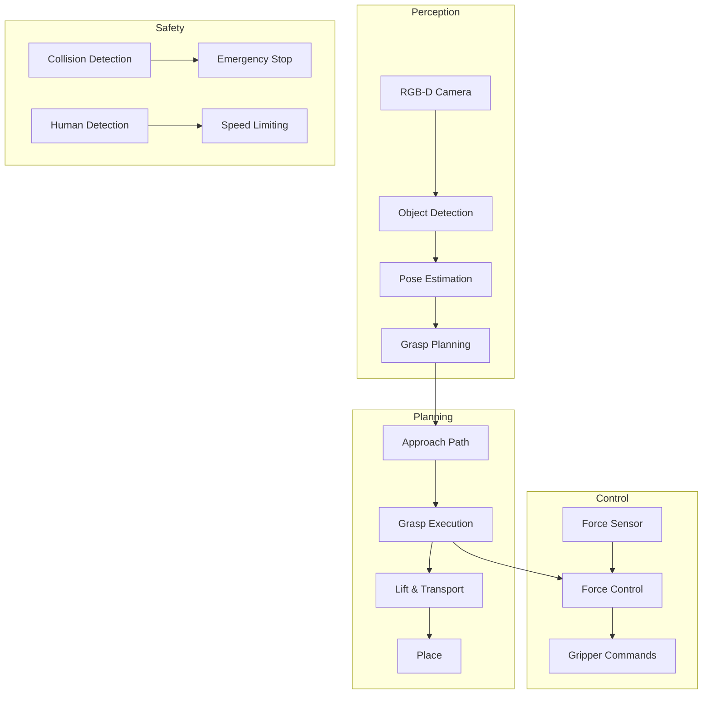

# Manipulation and Human-Robot Interaction

## Learning Outcomes

By the end of this chapter, you should be able to:
- Understand grasp planning and manipulation strategies
- Implement basic pick-and-place operations
- Design safe human-robot interaction systems
- Use force control for compliant manipulation
- Recognize the challenges of dexterous manipulation

## The Physics (Why)

Manipulation is fundamentally about **controlling contact forces**. When a robot grasps an object:
- **Normal forces** prevent the object from falling through the gripper
- **Friction forces** prevent the object from slipping
- **Torques** control object orientation

The challenge is that contact is **discontinuous**—forces change abruptly when contact is made or broken. This makes manipulation much harder than free-space motion.

For human-robot interaction, safety requires:
- **Force limiting**: Never apply dangerous forces to humans
- **Compliance**: Yield to unexpected contacts
- **Predictability**: Humans must understand robot intentions

## The Analogy (Mental Model)

Think of robot manipulation like **learning to use chopsticks**:

| Chopstick Challenge | Robot Equivalent |
|---------------------|------------------|
| Coordinating two sticks | Coordinating multiple fingers |
| Feeling food texture | Force/tactile sensing |
| Adjusting grip pressure | Force control |
| Not dropping food | Grasp stability |
| Not crushing soft food | Compliance control |

Just as chopstick mastery requires years of practice, dexterous robot manipulation remains an open research problem.

## The Visualization (Manipulation Pipeline)



## The Code (Implementation)

### Grasp Planning

```python
#!/usr/bin/env python3
"""
grasp_planning.py - Plan grasps for object manipulation.
"""

import numpy as np
from dataclasses import dataclass
from typing import List, Tuple, Optional


@dataclass
class GraspPose:
    """Represents a candidate grasp."""
    position: np.ndarray      # Gripper position
    orientation: np.ndarray   # Quaternion
    width: float              # Gripper opening width
    quality: float            # Grasp quality score


@dataclass
class ObjectInfo:
    """Information about object to grasp."""
    position: np.ndarray
    dimensions: np.ndarray    # (length, width, height)
    mass: float
    friction_coef: float


class GraspPlanner:
    """Plan stable grasps for objects."""
    
    def __init__(self, gripper_max_width: float = 0.1):
        self.gripper_max_width = gripper_max_width
        self.min_friction = 0.3
    
    def plan_grasps(
        self,
        obj: ObjectInfo,
        num_candidates: int = 10
    ) -> List[GraspPose]:
        """
        Generate candidate grasps for an object.
        
        Uses antipodal grasp heuristic: grasp along object's
        shortest dimension for stability.
        """
        candidates = []
        
        # Find graspable dimension (must fit in gripper)
        dims = obj.dimensions
        graspable_dims = [i for i, d in enumerate(dims) if d < self.gripper_max_width]
        
        if not graspable_dims:
            return []  # Object too large
        
        # Generate grasps along each graspable axis
        for dim_idx in graspable_dims:
            for angle in np.linspace(0, np.pi, num_candidates // len(graspable_dims)):
                grasp = self.generate_grasp(obj, dim_idx, angle)
                if grasp:
                    candidates.append(grasp)
        
        # Sort by quality
        candidates.sort(key=lambda g: g.quality, reverse=True)
        
        return candidates
    
    def generate_grasp(
        self,
        obj: ObjectInfo,
        grasp_axis: int,
        rotation: float
    ) -> Optional[GraspPose]:
        """Generate a single grasp candidate."""
        # Position at object center
        position = obj.position.copy()
        
        # Orientation based on grasp axis
        # (simplified - real implementation uses proper rotation matrices)
        orientation = np.array([0, 0, np.sin(rotation/2), np.cos(rotation/2)])
        
        # Width slightly larger than object dimension
        width = obj.dimensions[grasp_axis] + 0.01
        
        # Quality based on friction and stability
        quality = self.evaluate_grasp_quality(obj, grasp_axis)
        
        return GraspPose(
            position=position,
            orientation=orientation,
            width=width,
            quality=quality
        )
    
    def evaluate_grasp_quality(self, obj: ObjectInfo, grasp_axis: int) -> float:
        """
        Evaluate grasp quality using force closure analysis.
        
        Higher quality = more stable grasp.
        """
        # Simplified quality metric
        # Real implementation would use GraspIt! or similar
        
        # Prefer grasping along shortest dimension
        dims = obj.dimensions
        dim_score = 1.0 - (dims[grasp_axis] / max(dims))
        
        # Friction score
        friction_score = min(1.0, obj.friction_coef / self.min_friction)
        
        # Mass penalty (heavier objects harder to grasp)
        mass_score = 1.0 / (1.0 + obj.mass / 5.0)
        
        return 0.4 * dim_score + 0.4 * friction_score + 0.2 * mass_score


class PickAndPlace:
    """Execute pick and place operations."""
    
    def __init__(self, arm_controller, gripper_controller):
        self.arm = arm_controller
        self.gripper = gripper_controller
        self.planner = GraspPlanner()
    
    def pick(self, obj: ObjectInfo) -> bool:
        """Pick up an object."""
        # Plan grasp
        grasps = self.planner.plan_grasps(obj)
        if not grasps:
            return False
        
        best_grasp = grasps[0]
        
        # Open gripper
        self.gripper.open(best_grasp.width + 0.02)
        
        # Move to pre-grasp position (above object)
        pre_grasp = best_grasp.position.copy()
        pre_grasp[2] += 0.1  # 10cm above
        self.arm.move_to(pre_grasp, best_grasp.orientation)
        
        # Move to grasp position
        self.arm.move_to(best_grasp.position, best_grasp.orientation)
        
        # Close gripper
        success = self.gripper.close(force_limit=20.0)
        
        if success:
            # Lift object
            lift_pos = best_grasp.position.copy()
            lift_pos[2] += 0.15
            self.arm.move_to(lift_pos, best_grasp.orientation)
        
        return success
    
    def place(self, target_position: np.ndarray) -> bool:
        """Place held object at target position."""
        # Move above target
        above_target = target_position.copy()
        above_target[2] += 0.1
        self.arm.move_to(above_target)
        
        # Lower to target
        self.arm.move_to(target_position)
        
        # Open gripper
        self.gripper.open()
        
        # Retreat
        self.arm.move_to(above_target)
        
        return True
```

### Force Control for Compliant Manipulation

```python
#!/usr/bin/env python3
"""
force_control.py - Compliant manipulation with force feedback.
"""

import numpy as np
from dataclasses import dataclass
from typing import Tuple


@dataclass
class ForceReading:
    """6-axis force/torque reading."""
    force: np.ndarray   # (fx, fy, fz)
    torque: np.ndarray  # (tx, ty, tz)


class ImpedanceController:
    """
    Impedance control for compliant manipulation.
    
    Makes the robot behave like a mass-spring-damper system,
    allowing safe interaction with environment and humans.
    """
    
    def __init__(
        self,
        stiffness: np.ndarray = None,
        damping: np.ndarray = None,
        mass: np.ndarray = None
    ):
        # Default parameters (can be tuned per task)
        self.K = stiffness if stiffness is not None else np.array([500, 500, 500])
        self.D = damping if damping is not None else np.array([50, 50, 50])
        self.M = mass if mass is not None else np.array([1, 1, 1])
        
        # State
        self.position = np.zeros(3)
        self.velocity = np.zeros(3)
    
    def compute_command(
        self,
        desired_position: np.ndarray,
        current_position: np.ndarray,
        current_velocity: np.ndarray,
        external_force: np.ndarray
    ) -> np.ndarray:
        """
        Compute position command with impedance behavior.
        
        F = M*a + D*v + K*x
        
        The robot will yield to external forces while trying
        to reach the desired position.
        """
        # Position error
        pos_error = desired_position - current_position
        
        # Impedance equation: solve for acceleration
        # M*a = F_ext - D*v - K*x
        acceleration = (
            external_force - 
            self.D * current_velocity - 
            self.K * pos_error
        ) / self.M
        
        # Integrate to get velocity and position
        dt = 0.01  # 100 Hz control
        new_velocity = current_velocity + acceleration * dt
        new_position = current_position + new_velocity * dt
        
        return new_position
    
    def set_stiffness(self, stiffness: np.ndarray):
        """Adjust stiffness (higher = stiffer, less compliant)."""
        self.K = np.clip(stiffness, 10, 2000)
    
    def set_compliant_mode(self):
        """Set low stiffness for safe human interaction."""
        self.K = np.array([100, 100, 100])
        self.D = np.array([20, 20, 20])
    
    def set_stiff_mode(self):
        """Set high stiffness for precise positioning."""
        self.K = np.array([1000, 1000, 1000])
        self.D = np.array([100, 100, 100])


class SafeHumanInteraction:
    """Safety system for human-robot interaction."""
    
    def __init__(self):
        # Safety limits
        self.max_force = 50.0      # Newtons
        self.max_speed = 0.5       # m/s near humans
        self.min_distance = 0.3   # meters
        
        # State
        self.human_detected = False
        self.human_distance = float('inf')
    
    def update_human_detection(self, distance: float):
        """Update human proximity information."""
        self.human_distance = distance
        self.human_detected = distance < 2.0
    
    def get_safe_speed_limit(self) -> float:
        """Get speed limit based on human proximity."""
        if not self.human_detected:
            return 1.0  # Full speed
        
        if self.human_distance < self.min_distance:
            return 0.0  # Stop
        
        # Linear scaling between min_distance and 2m
        scale = (self.human_distance - self.min_distance) / (2.0 - self.min_distance)
        return self.max_speed * scale
    
    def check_force_limit(self, force: ForceReading) -> Tuple[bool, str]:
        """Check if force exceeds safety limits."""
        force_magnitude = np.linalg.norm(force.force)
        
        if force_magnitude > self.max_force:
            return False, f"Force limit exceeded: {force_magnitude:.1f}N > {self.max_force}N"
        
        return True, "OK"
    
    def should_emergency_stop(self, force: ForceReading) -> bool:
        """Determine if emergency stop is needed."""
        force_magnitude = np.linalg.norm(force.force)
        
        # Emergency stop if force is way over limit
        if force_magnitude > self.max_force * 1.5:
            return True
        
        # Emergency stop if human too close
        if self.human_distance < 0.1:
            return True
        
        return False
```

### ROS 2 Manipulation Node

```python
#!/usr/bin/env python3
"""
manipulation_node.py - ROS 2 node for manipulation tasks.
"""

import rclpy
from rclpy.node import Node
from geometry_msgs.msg import PoseStamped, WrenchStamped
from sensor_msgs.msg import JointState
from std_msgs.msg import Bool
import numpy as np


class ManipulationNode(Node):
    """ROS 2 node for humanoid manipulation."""
    
    def __init__(self):
        super().__init__('manipulation_node')
        
        # Controllers
        self.impedance = ImpedanceController()
        self.safety = SafeHumanInteraction()
        
        # State
        self.current_pose = None
        self.current_force = None
        self.target_pose = None
        
        # Subscribers
        self.pose_sub = self.create_subscription(
            PoseStamped, '/arm/current_pose', self.pose_callback, 10
        )
        self.force_sub = self.create_subscription(
            WrenchStamped, '/arm/force_torque', self.force_callback, 10
        )
        self.target_sub = self.create_subscription(
            PoseStamped, '/arm/target_pose', self.target_callback, 10
        )
        
        # Publishers
        self.cmd_pub = self.create_publisher(
            PoseStamped, '/arm/command_pose', 10
        )
        self.stop_pub = self.create_publisher(
            Bool, '/emergency_stop', 10
        )
        
        # Control loop at 100 Hz
        self.timer = self.create_timer(0.01, self.control_loop)
        
        self.get_logger().info('Manipulation node started')
    
    def pose_callback(self, msg: PoseStamped):
        """Update current end-effector pose."""
        self.current_pose = np.array([
            msg.pose.position.x,
            msg.pose.position.y,
            msg.pose.position.z
        ])
    
    def force_callback(self, msg: WrenchStamped):
        """Update force/torque reading."""
        self.current_force = ForceReading(
            force=np.array([
                msg.wrench.force.x,
                msg.wrench.force.y,
                msg.wrench.force.z
            ]),
            torque=np.array([
                msg.wrench.torque.x,
                msg.wrench.torque.y,
                msg.wrench.torque.z
            ])
        )
    
    def target_callback(self, msg: PoseStamped):
        """Update target pose."""
        self.target_pose = np.array([
            msg.pose.position.x,
            msg.pose.position.y,
            msg.pose.position.z
        ])
    
    def control_loop(self):
        """Main control loop with safety checks."""
        if self.current_pose is None or self.target_pose is None:
            return
        
        # Safety checks
        if self.current_force:
            if self.safety.should_emergency_stop(self.current_force):
                self.emergency_stop()
                return
            
            safe, msg = self.safety.check_force_limit(self.current_force)
            if not safe:
                self.get_logger().warn(msg)
                self.impedance.set_compliant_mode()
        
        # Compute command with impedance control
        external_force = self.current_force.force if self.current_force else np.zeros(3)
        
        command_pos = self.impedance.compute_command(
            desired_position=self.target_pose,
            current_position=self.current_pose,
            current_velocity=np.zeros(3),  # Would come from velocity estimation
            external_force=external_force
        )
        
        # Publish command
        cmd_msg = PoseStamped()
        cmd_msg.header.stamp = self.get_clock().now().to_msg()
        cmd_msg.pose.position.x = command_pos[0]
        cmd_msg.pose.position.y = command_pos[1]
        cmd_msg.pose.position.z = command_pos[2]
        
        self.cmd_pub.publish(cmd_msg)
    
    def emergency_stop(self):
        """Trigger emergency stop."""
        self.get_logger().error('EMERGENCY STOP')
        stop_msg = Bool()
        stop_msg.data = True
        self.stop_pub.publish(stop_msg)


def main(args=None):
    rclpy.init(args=args)
    node = ManipulationNode()
    rclpy.spin(node)
    node.destroy_node()
    rclpy.shutdown()


if __name__ == '__main__':
    main()
```

## The Hardware Reality (Warning)

:::danger Human Safety is Paramount
When robots interact with humans:
- **ISO 10218**: Industrial robot safety standards
- **ISO/TS 15066**: Collaborative robot safety
- **Force limits**: Max 150N transient, 65N quasi-static for human contact
- **Speed limits**: Max 250mm/s in collaborative mode

Violating these limits can cause serious injury.
:::

:::warning Gripper Selection
Choose grippers based on task requirements:

| Gripper Type | Payload | Dexterity | Cost |
|--------------|---------|-----------|------|
| Parallel jaw | High | Low | $500-2k |
| Soft gripper | Medium | Medium | $1k-5k |
| Dexterous hand | Low | High | $20k-100k |

Most humanoid applications use parallel jaw grippers for reliability.
:::

## Assessment

### Recall

1. What is impedance control and why is it important for manipulation?
2. What are the ISO safety standards for collaborative robots?
3. What is an antipodal grasp?
4. Why is force sensing important for manipulation?

### Apply

1. Implement a grasp planner for cylindrical objects (cups, bottles).
2. Write a safety monitor that limits robot speed based on human proximity.
3. Design an impedance controller that becomes more compliant when force exceeds a threshold.

### Analyze

1. Compare the trade-offs between position control and force control for manipulation.
2. Why is dexterous manipulation with multi-fingered hands still an open research problem?
3. Design a human-robot handover protocol that is both safe and efficient.
