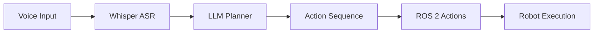

# Conversational Robotics & VLA Models

## Learning Outcomes

By the end of this chapter, you should be able to:
- Integrate speech recognition with robots using OpenAI Whisper
- Use LLMs for cognitive planning and task decomposition
- Understand Vision-Language-Action (VLA) models
- Build a complete voice-to-action pipeline
- Design multi-modal interaction systems for humanoid robots

## The Physics (Why)

Human communication is inherently multi-modal—we speak, gesture, point, and use facial expressions simultaneously. For robots to work alongside humans naturally, they must understand and respond to these communication channels.

The challenge is bridging the **semantic gap** between:
- **Human intent**: "Get me a drink from the fridge"
- **Robot actions**: Navigate → Open door → Grasp bottle → Close door → Navigate → Hand over

This requires understanding language, perceiving the environment, planning actions, and executing them safely—all in real-time.

## The Analogy (Mental Model)

Think of a conversational robot as a **multilingual translator** working in three languages:
1. **Human Language**: Natural speech and gestures
2. **Semantic Language**: Abstract goals and intentions
3. **Robot Language**: Motor commands and sensor readings

Just as a human translator must understand context, culture, and nuance, a conversational robot must understand:
- **Context**: "Put it there" requires knowing what "it" and "there" refer to
- **Intent**: "Can you get me water?" is a request, not a question about capability
- **Safety**: "Throw me the ball" shouldn't be interpreted literally for heavy objects

## The Visualization (System Architecture)

The future of human-robot interaction lies in natural language. Users should be able to simply tell a robot what to do.



## The Code (Implementation)

### Speech Recognition with Whisper

OpenAI's Whisper provides state-of-the-art speech recognition:

```python
import whisper
import sounddevice as sd
import numpy as np

# Load Whisper model
model = whisper.load_model("base")

def record_audio(duration=5, sample_rate=16000):
    """Record audio from microphone."""
    audio = sd.rec(int(duration * sample_rate), 
                   samplerate=sample_rate, 
                   channels=1)
    sd.wait()
    return audio.flatten()

def transcribe(audio):
    """Transcribe audio to text."""
    result = model.transcribe(audio)
    return result["text"]

# Example usage
audio = record_audio()
command = transcribe(audio)
print(f"You said: {command}")
```

### Cognitive Planning with LLMs

LLMs can translate natural language commands into robot action sequences:

```python
from openai import OpenAI

client = OpenAI()

def plan_actions(command: str) -> list:
    """Use GPT to plan robot actions from natural language."""
    
    system_prompt = """You are a robot action planner. 
    Convert natural language commands into a sequence of robot actions.
    Available actions: move_to(x,y), pick_up(object), place(location), 
    rotate(degrees), speak(message)
    
    Return actions as a JSON array."""
    
    response = client.chat.completions.create(
        model="gpt-4",
        messages=[
            {"role": "system", "content": system_prompt},
            {"role": "user", "content": command}
        ]
    )
    
    return response.choices[0].message.content

# Example
command = "Pick up the red cup from the table and bring it to me"
actions = plan_actions(command)
print(actions)
# Output: [
#   {"action": "move_to", "params": {"target": "table"}},
#   {"action": "pick_up", "params": {"object": "red cup"}},
#   {"action": "move_to", "params": {"target": "user"}},
#   {"action": "place", "params": {"location": "user_hand"}}
# ]
```

### Vision-Language-Action (VLA) Models

VLA models combine vision, language understanding, and action generation in a single model.

### Architecture

```text
┌─────────────────────────────────────────────┐
│              VLA Model                       │
├─────────────┬─────────────┬─────────────────┤
│   Vision    │  Language   │    Action       │
│   Encoder   │  Encoder    │    Decoder      │
├─────────────┼─────────────┼─────────────────┤
│   Camera    │   Text      │   Motor         │
│   Input     │   Command   │   Commands      │
└─────────────┴─────────────┴─────────────────┘
```

### Key VLA Models

| Model | Developer | Capabilities |
|-------|-----------|--------------|
| RT-2 | Google | Vision-language-action for manipulation |
| PaLM-E | Google | Embodied multimodal language model |
| Gato | DeepMind | Generalist agent across tasks |

:::tip The Future
VLA models represent the convergence of LLMs and robotics, enabling robots to understand and act on natural language in the physical world.
:::

## The Hardware Reality (Warning)

:::danger Latency is Critical
Conversational robots must respond quickly to feel natural:
- **Speech recognition**: under 500ms for real-time feel
- **LLM planning**: 1-3 seconds acceptable for complex tasks
- **Action execution**: Must start within 2 seconds of command

Running large models locally requires significant hardware:
- **Whisper large**: 10GB VRAM, ~1s/audio second
- **LLM (7B params)**: 14GB VRAM minimum
- **VLA models**: Often require cloud inference
:::

:::warning Edge Deployment Challenges
For standalone humanoid robots:
- **Jetson Orin**: Can run Whisper small + quantized LLMs
- **Cloud dependency**: Larger models require network connectivity
- **Privacy concerns**: Voice data may contain sensitive information
- **Reliability**: Network failures must have graceful fallbacks
:::

### Recommended Hardware Stack

| Component | Edge (Jetson) | Workstation | Cloud |
|-----------|---------------|-------------|-------|
| **ASR** | Whisper tiny/base | Whisper medium | Whisper large-v3 |
| **LLM** | Llama 3 8B (4-bit) | Llama 3 70B | GPT-4 / Claude |
| **VLA** | Not feasible | RT-2 (research) | API services |
| **Latency** | 2-5 seconds | 1-2 seconds | 0.5-3 seconds |

## Capstone Project: The Autonomous Humanoid

Your final project integrates everything you've learned:

1. **Voice Command**: User speaks a command
2. **Speech Recognition**: Whisper transcribes to text
3. **Planning**: LLM generates action sequence
4. **Navigation**: Nav2 plans path to target
5. **Perception**: Isaac ROS identifies objects
6. **Manipulation**: Robot executes the task

```python
# Capstone architecture
class AutonomousHumanoid:
    def __init__(self):
        self.whisper = WhisperASR()
        self.planner = LLMPlanner()
        self.navigator = Nav2Navigator()
        self.perception = IsaacPerception()
        self.manipulator = ArmController()
    
    async def execute_command(self, audio):
        # 1. Transcribe
        text = self.whisper.transcribe(audio)
        
        # 2. Plan
        actions = self.planner.plan(text)
        
        # 3. Execute
        for action in actions:
            if action.type == "navigate":
                await self.navigator.go_to(action.target)
            elif action.type == "pick":
                obj = self.perception.find(action.object)
                await self.manipulator.pick(obj)
            elif action.type == "place":
                await self.manipulator.place(action.location)
```

## Assessments

1. Design a voice-to-action pipeline for a robot that can "fetch items from the kitchen."
2. What are the challenges of using LLMs for real-time robot control?
3. Compare the approaches of RT-2 and traditional perception + planning pipelines.
4. How would you handle ambiguous voice commands in a conversational robot?
